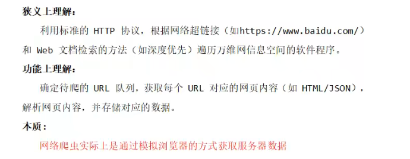
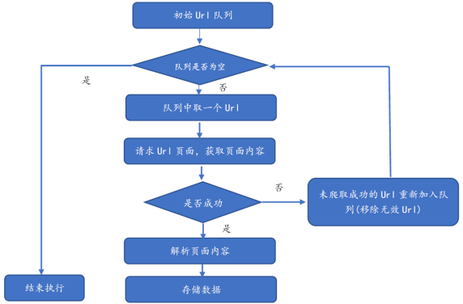
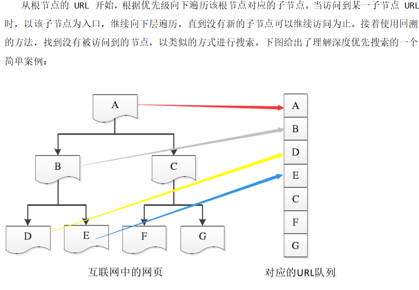
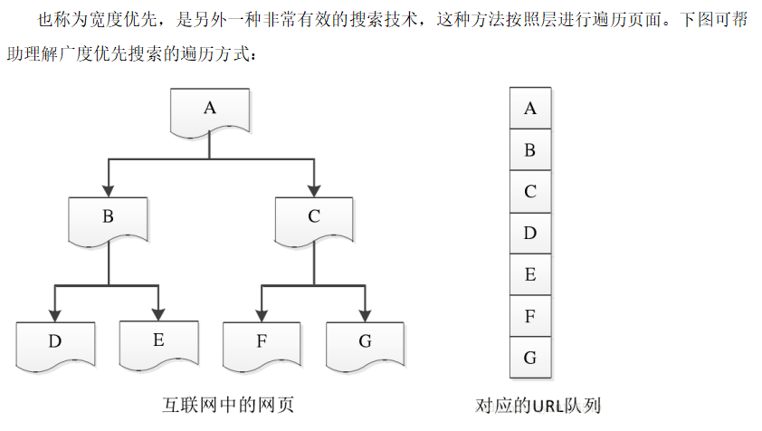
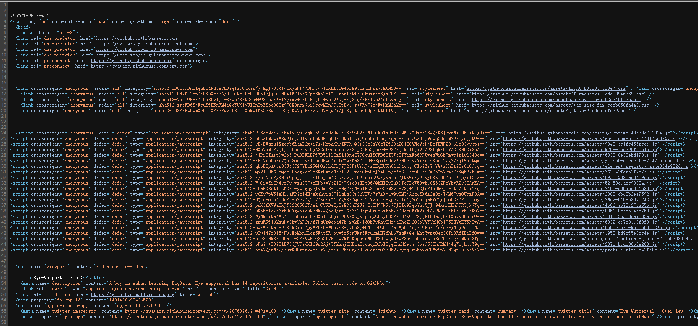
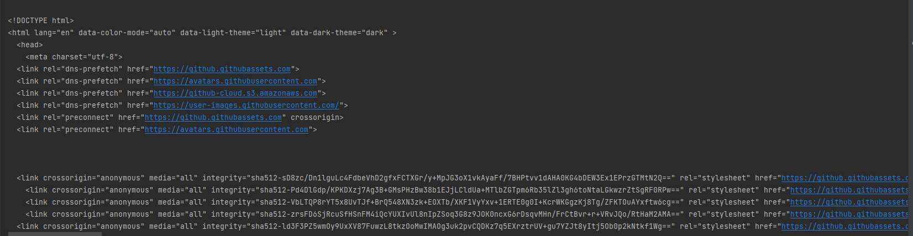
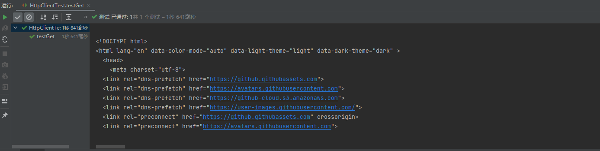
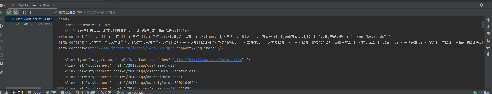

## 网络爬虫（Web Crawler）

### 定义：

及web信息采集器，是一种按照一定规则，自动抓取或下载网络信息的计算机程序或自动化脚本。



### 功能：

- 可以实现搜索引擎
- 获取更多的数据源
- 更好地进行搜索引擎优化（SEO）

### 分类：

- 通用网络爬虫

​		爬行对象从一些种子 URL 扩充到整个 Web，主要为门户站点搜索引擎和大型 Web 服务提供商采集数据。通用网络爬虫的爬取范围和数量巨大，对于爬行速度和存储空间要求较高，对于爬行页面的顺序要求较低，通常采用并行工作方式，有较强的应用价值。

- 聚焦网络爬虫

​		又称为主题网络爬虫：是指选择性地爬行那些与预先定义好的主题相关的页面。和通用爬虫相比，聚焦爬虫只需要爬行**与主题相关**的页面，极大地节省了硬件和网络资源，保存的页面也由于数量少而更新快，可以很好地满足一些特定人群对特定领域信息的需求。通常在设计聚焦网络爬虫时，需要加入链接和内容筛选模块。

- 增量网络爬虫

​		对已下载网页采取**增量式更新**和只爬行**新产生**的或者已经**发生变化**网页的爬虫，它能够在一定程度上保证所爬行的页面是尽可能新的页面，历史已经采集过的页面不重复采集。增量网络爬虫避免了重复采集数据，可以减小时间和空间上的耗费。通常在设计网络爬虫时，需要在数据库中，加入时间戳，基于时间戳上的先后，判断程序是否继续执行。

- Deep Web 爬虫

​		指大部分内容不能通过静态链接获取，只有用户提交一些表单信息才能获取的 Web 页面。例如，需要模拟登陆的网络爬虫便属于这类网络爬虫。另外，还有一些需要用户提交关键词才能获取的内容，如京东淘宝提交关键字、价格区间获取产品的相关信息。

**实际的网络爬虫系统通常是几种爬虫技术相结合实现的**

### 流程：



### 爬行策略：

1、深度优先



2、广度优先



基于广度优先的的爬虫时最简单的爬取网站页面的方法，也是目前使用较为广泛的方法。


## Java爬虫

### 准备工作

新建一个maven工程（因为爬虫是系列课程的一个模块，所以新建子模块）

在Crawler（爬虫模块）的pom.xml里添加依赖（插入dependencies标签中）

```xml
<dependency>
    <!--模拟浏览器发送http请求的工具-->
    <groupId>org.apache.httpcomponents</groupId>
    <artifactId>httpclient</artifactId>
    <version>4.5.3</version>
</dependency>
<dependency>
    <!--解析页面-->
    <groupId>org.jsoup</groupId>
    <artifactId>jsoup</artifactId>
    <version>1.10.3</version>
</dependency>
<dependency>
    <!--做单元测试-->
    <groupId>junit</groupId>
    <artifactId>junit</artifactId>
    <version>4.12</version>
</dependency>
<!--这两个为文件字符串操作工具-->
<dependency>
    <groupId>org.apache.commons</groupId>
    <artifactId>commons-lang3</artifactId>
    <version>3.7</version>
</dependency>
<dependency>
    <groupId>commons-io</groupId>
    <artifactId>commons-io</artifactId>
    <version>2.6</version>
</dependency>
<dependency>
    <!--日志工具-->
    <groupId>org.slf4j</groupId>
    <artifactId>slf4j-log4j12</artifactId>
    <version>1.7.25</version>
</dependency>
```

配置日志文件日志级别（log4j.properties）

```properties
log4j.rootLogger=DEBUG,A1
log4j.logger.cn.itcast = DEBUG
log4j.appender.A1=org.apache.log4j.ConsoleAppender
log4j.appender.A1.layout=org.apache.log4j.PatternLayout
log4j.appender.A1.layout.ConversionPattern=%-d{yyyy-MM-dd HH:mm:ss,SSS} [%t] [%c]-[%p] %m%n
```

准备工作完成

### URL Connection

URL Connection 是 JDK 自带的一个抽象类，其代表应用程序和 URL 之间的通信链接。在网络爬虫中，我们可以使用 URL Connection 请求一个 URL 地址，然后获取流信息，通过对流信息的操作，可获得请求到的实体内容

```java
package com.tal;
/* 
    @TODO: 演示使用JDK自带的API实现网络爬虫
    @Author tal
*/

import org.junit.Test;

import java.io.BufferedReader;
import java.io.InputStream;
import java.io.InputStreamReader;
import java.net.HttpURLConnection;
import java.net.URL;
import java.net.URLConnection;


public class JDKAPITest {
    @Test
    public void testGet() throws Exception {
        // 1. 确定要访问、爬取的URL
        URL url = new URL("https://github.com/Eye-Wuppertal");

        // 2. 获取连接对象
        URLConnection urlConnection = url.openConnection();
        HttpURLConnection httpURLConnection = (HttpURLConnection) url.openConnection(); // 指定http连接

        // 3. 设置连接信息：请求方式、请求参数、请求头等
        httpURLConnection.setRequestMethod("GET");   // 请求方式默认就是GET，必须为大写
        // 设置属性Property 参数 "key:  ","value:  "
        httpURLConnection.setRequestProperty("User-Agent","Mozilla/5.0 (Windows NT 10.0; Win64; x64) AppleWebKit/537.36 (KHTML, like Gecko) Chrome/99.0.4844.51 Safari/537.36");
        httpURLConnection.setConnectTimeout(30000);  // 设置超时时间，单位毫秒

        // 4. 获取数据
        InputStream inputStream = httpURLConnection.getInputStream();   // 获取响应回来的数据流
        BufferedReader reader = new BufferedReader(new InputStreamReader(inputStream));  //将获取的数据封装成BufferReader一行一行读出来
        String line;
        String html = "";
        while((line = reader.readLine()) != null ){
            html += line + "\n";
        }
        System.out.println(html.toString());

        // 5. 关闭资源
        inputStream.close();
        reader.close();


    }
}
```

使用的网页url 内容为：



控制台输出为：



post测试

```java
@Test
    public void testPOST() throws Exception {
        // 1. 确定要访问、爬取的URL
        URL url = new URL("https://www.itcast.cn/");

        // 2. 获取连接对象
        HttpURLConnection httpURLConnection = (HttpURLConnection) url.openConnection(); // 指定http连接

        // 3. 设置连接信息：请求方式、请求参数、请求头等
        httpURLConnection.setDoOutput(true);    // 允许向URL输出内容
        httpURLConnection.setRequestMethod("POST");
        httpURLConnection.setRequestProperty("User-Agent","Mozilla/5.0 (Windows NT 10.0; Win64; x64) AppleWebKit/537.36 (KHTML, like Gecko) Chrome/99.0.4844.51 Safari/537.36");
        httpURLConnection.setConnectTimeout(30000);  // 设置超时时间，单位毫秒
        OutputStream outputStream = httpURLConnection.getOutputStream();  // 默认不让用，需要第一步的setDoOutput
        outputStream.write("username=xx".getBytes());

        // 4. 获取数据
        InputStream inputStream = httpURLConnection.getInputStream();   // 获取响应回来的数据流
        BufferedReader reader = new BufferedReader(new InputStreamReader(inputStream));  //将获取的数据封装成BufferReader一行一行读出来
        String line;
        String html = "";
        while((line = reader.readLine()) != null ){
            html += line + "\n";
        }
        System.out.println(html.toString());

        // 5. 关闭资源
        inputStream.close();
        reader.close();
```

访问github失败，不允许直接post

### Http Client

HttpClient 是 Apache Jakarta Common 下的子项目，用来提供高效的、最新的、功能丰富的支持 HTTP 协议的客户端编程工具包，并且它支持 HTTP 协议最新的版本和建议。其相比于传统 JDK 自带的 URLConnection，增加了易用性和灵活性。其功能主要是用来向服务器发送请求，并返回相关资源。在网络爬虫实战中，经常使用 HttpClient 获取网页内容，使用 jsoup 解析网页内容。

```java
package com.tal;
/* 
    @TODO: 演示使用httpClient实现网络爬虫
    @Author tal
*/

import org.apache.http.client.methods.CloseableHttpResponse;
import org.apache.http.client.methods.HttpGet;
import org.apache.http.impl.client.CloseableHttpClient;
import org.apache.http.impl.client.DefaultHttpClient;
import org.apache.http.impl.client.HttpClients;
import org.apache.http.util.EntityUtils;
import org.junit.Test;

import java.io.IOException;

public class HttpClientTest {
    @Test
    public void testGet() throws Exception {
        // 1. 创建HttpClient对象
        // DefaultHttpClient defaultHttpClient = new DefaultHttpClient(); // 已失效
        CloseableHttpClient httpClient = HttpClients.createDefault();

        // 2. 创建HttpClient请求并进行相关设置
        HttpGet httpGet = new HttpGet("https://github.com/search?q=res");
        httpGet.setHeader("User-Agent","indows NT 10.Mozilla/5.0 (W0; Win64; x64) AppleWebKit/537.36 (KHTML, like Gecko) Chrome/99.0.4844.51 Safari/537.36");

        // 3. 发起请求
        CloseableHttpResponse response = httpClient.execute(httpGet);

        // 4. 判断响应状态并获取相应数据
        if(response.getStatusLine().getStatusCode() == 200){  // 200表示响应成功
            String html = EntityUtils.toString(response.getEntity(), "UTF-8");
            System.out.println(html);

        }

        // 5. 关闭资源
        httpClient.close();
        response.close();
    }
}
```



post

```java
 @Test
    public void testPost() throws IOException {
        // 1. 创建HttpClient对象
        // DefaultHttpClient defaultHttpClient = new DefaultHttpClient(); // 已失效
        CloseableHttpClient httpClient = HttpClients.createDefault();

        // 2. 创建HttpClient请求并进行相关设置
        HttpPost httpPost = new HttpPost("https://www.itcast.cn/");
        // 准备集合存放请求参数
        ArrayList<NameValuePair> params = new ArrayList<>();
        params.add(new BasicNameValuePair("username","java"));
        UrlEncodedFormEntity entity = new UrlEncodedFormEntity(params, "UTF-8");
        httpPost.setEntity(entity);     // 设置请求体/参数
        httpPost.setHeader("User-Agent","indows NT 10.Mozilla/5.0 (W0; Win64; x64) AppleWebKit/537.36 (KHTML, like Gecko) Chrome/99.0.4844.51 Safari/537.36");

        // 3. 发起请求
        CloseableHttpResponse response = httpClient.execute(httpPost);

        // 4. 判断响应状态并获取相应数据
        if(response.getStatusLine().getStatusCode() == 200){  // 200表示响应成功
            String html = EntityUtils.toString(response.getEntity(), "UTF-8");
            System.out.println(html);
        }

        // 5. 关闭资源
        httpClient.close();
        response.close();
    }
```



每次请求资源都关闭HttpClient，会浪费资源，引入连接池

```java
@Test
// 测试httpClient连接池
public void testPool() throws IOException {
    // 1、创建HttpClient 连接管理器
    PoolingHttpClientConnectionManager cm = new PoolingHttpClientConnectionManager();

    // 2、设置参数
    cm.setMaxTotal(200);            // 设置最大连接数
    cm.setDefaultMaxPerRoute(20);   // 设置主机的最大并发
    doGet(cm);
    doGet(cm);
}

private void doGet(PoolingHttpClientConnectionManager cm) throws IOException {
    // 3、从连接池中获取httpClient对象
    CloseableHttpClient httpClient = HttpClients.custom().setConnectionManager(cm).build();
    // 断点观察到，每次从池中获取到一个HttpClient对象

    // 4、创建HttpGet对象
    HttpGet httpGet = new HttpGet("https://www.itcast.cn/");

    // 5、发送请求
    CloseableHttpResponse response = httpClient.execute(httpGet);;

    // 6、获取数据
    if(response.getStatusLine().getStatusCode() == 200){  // 200表示响应成功
        String html = EntityUtils.toString(response.getEntity(), "UTF-8");
        System.out.println(html);
    }

    // 7、关闭资源
    // httpClient.close(); 不用关闭httpClient对象，因为使用连接池，HttpClient对象使用完后要回到连接池中，而不是关掉
    response.close();
}
```

