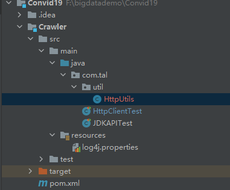

## 网络爬虫（Web Crawler）

### 定义：

及web信息采集器，是一种按照一定规则，自动抓取或下载网络信息的计算机程序或自动化脚本。


### 功能：

- 可以实现搜索引擎
- 获取更多的数据源
- 更好地进行搜索引擎优化（SEO）

### 分类：

- 通用网络爬虫

​		爬行对象从一些种子 URL 扩充到整个 Web，主要为门户站点搜索引擎和大型 Web 服务提供商采集数据。通用网络爬虫的爬取范围和数量巨大，对于爬行速度和存储空间要求较高，对于爬行页面的顺序要求较低，通常采用并行工作方式，有较强的应用价值。

- 聚焦网络爬虫

​		又称为主题网络爬虫：是指选择性地爬行那些与预先定义好的主题相关的页面。和通用爬虫相比，聚焦爬虫只需要爬行**与主题相关**的页面，极大地节省了硬件和网络资源，保存的页面也由于数量少而更新快，可以很好地满足一些特定人群对特定领域信息的需求。通常在设计聚焦网络爬虫时，需要加入链接和内容筛选模块。

- 增量网络爬虫

​		对已下载网页采取**增量式更新**和只爬行**新产生**的或者已经**发生变化**网页的爬虫，它能够在一定程度上保证所爬行的页面是尽可能新的页面，历史已经采集过的页面不重复采集。增量网络爬虫避免了重复采集数据，可以减小时间和空间上的耗费。通常在设计网络爬虫时，需要在数据库中，加入时间戳，基于时间戳上的先后，判断程序是否继续执行。

- Deep Web 爬虫

​		指大部分内容不能通过静态链接获取，只有用户提交一些表单信息才能获取的 Web 页面。例如，需要模拟登陆的网络爬虫便属于这类网络爬虫。另外，还有一些需要用户提交关键词才能获取的内容，如京东淘宝提交关键字、价格区间获取产品的相关信息。

**实际的网络爬虫系统通常是几种爬虫技术相结合实现的**

### 流程：


### 爬行策略：

1、深度优先


2、广度优先


基于广度优先的的爬虫时最简单的爬取网站页面的方法，也是目前使用较为广泛的方法。


## Java爬虫

### 准备工作

新建一个maven工程（因为爬虫是系列课程的一个模块，所以新建子模块）

在Crawler（爬虫模块）的pom.xml里添加依赖（插入dependencies标签中）

```xml
<dependency>
    <!--模拟浏览器发送http请求的工具-->
    <groupId>org.apache.httpcomponents</groupId>
    <artifactId>httpclient</artifactId>
    <version>4.5.3</version>
</dependency>
<dependency>
    <!--解析页面-->
    <groupId>org.jsoup</groupId>
    <artifactId>jsoup</artifactId>
    <version>1.10.3</version>
</dependency>
<dependency>
    <!--做单元测试-->
    <groupId>junit</groupId>
    <artifactId>junit</artifactId>
    <version>4.12</version>
</dependency>
<!--这两个为文件字符串操作工具-->
<dependency>
    <groupId>org.apache.commons</groupId>
    <artifactId>commons-lang3</artifactId>
    <version>3.7</version>
</dependency>
<dependency>
    <groupId>commons-io</groupId>
    <artifactId>commons-io</artifactId>
    <version>2.6</version>
</dependency>
<dependency>
    <!--日志工具-->
    <groupId>org.slf4j</groupId>
    <artifactId>slf4j-log4j12</artifactId>
    <version>1.7.25</version>
</dependency>
```

配置日志文件日志级别（log4j.properties）

```properties
log4j.rootLogger=DEBUG,A1
log4j.logger.cn.itcast = DEBUG
log4j.appender.A1=org.apache.log4j.ConsoleAppender
log4j.appender.A1.layout=org.apache.log4j.PatternLayout
log4j.appender.A1.layout.ConversionPattern=%-d{yyyy-MM-dd HH:mm:ss,SSS} [%t] [%c]-[%p] %m%n
```

准备工作完成

### URL Connection

URL Connection 是 JDK 自带的一个抽象类，其代表应用程序和 URL 之间的通信链接。在网络爬虫中，我们可以使用 URL Connection 请求一个 URL 地址，然后获取流信息，通过对流信息的操作，可获得请求到的实体内容

```java
package com.tal;
/* 
    @TODO: 演示使用JDK自带的API实现网络爬虫
    @Author tal
*/

import org.junit.Test;

import java.io.BufferedReader;
import java.io.InputStream;
import java.io.InputStreamReader;
import java.net.HttpURLConnection;
import java.net.URL;
import java.net.URLConnection;


public class JDKAPITest {
    @Test
    public void testGet() throws Exception {
        // 1. 确定要访问、爬取的URL
        URL url = new URL("https://github.com/Eye-Wuppertal");

        // 2. 获取连接对象
        URLConnection urlConnection = url.openConnection();
        HttpURLConnection httpURLConnection = (HttpURLConnection) url.openConnection(); // 指定http连接

        // 3. 设置连接信息：请求方式、请求参数、请求头等
        httpURLConnection.setRequestMethod("GET");   // 请求方式默认就是GET，必须为大写
        // 设置属性Property 参数 "key:  ","value:  "
        httpURLConnection.setRequestProperty("User-Agent","Mozilla/5.0 (Windows NT 10.0; Win64; x64) AppleWebKit/537.36 (KHTML, like Gecko) Chrome/99.0.4844.51 Safari/537.36");
        httpURLConnection.setConnectTimeout(30000);  // 设置超时时间，单位毫秒

        // 4. 获取数据
        InputStream inputStream = httpURLConnection.getInputStream();   // 获取响应回来的数据流
        BufferedReader reader = new BufferedReader(new InputStreamReader(inputStream));  //将获取的数据封装成BufferReader一行一行读出来
        String line;
        String html = "";
        while((line = reader.readLine()) != null ){
            html += line + "\n";
        }
        System.out.println(html.toString());

        // 5. 关闭资源
        inputStream.close();
        reader.close();


    }
}
```

使用的网页url 内容为：


控制台输出为：


post测试

```java
@Test
    public void testPOST() throws Exception {
        // 1. 确定要访问、爬取的URL
        URL url = new URL("https://www.itcast.cn/");

        // 2. 获取连接对象
        HttpURLConnection httpURLConnection = (HttpURLConnection) url.openConnection(); // 指定http连接

        // 3. 设置连接信息：请求方式、请求参数、请求头等
        httpURLConnection.setDoOutput(true);    // 允许向URL输出内容
        httpURLConnection.setRequestMethod("POST");
        httpURLConnection.setRequestProperty("User-Agent","Mozilla/5.0 (Windows NT 10.0; Win64; x64) AppleWebKit/537.36 (KHTML, like Gecko) Chrome/99.0.4844.51 Safari/537.36");
        httpURLConnection.setConnectTimeout(30000);  // 设置超时时间，单位毫秒
        OutputStream outputStream = httpURLConnection.getOutputStream();  // 默认不让用，需要第一步的setDoOutput
        outputStream.write("username=xx".getBytes());

        // 4. 获取数据
        InputStream inputStream = httpURLConnection.getInputStream();   // 获取响应回来的数据流
        BufferedReader reader = new BufferedReader(new InputStreamReader(inputStream));  //将获取的数据封装成BufferReader一行一行读出来
        String line;
        String html = "";
        while((line = reader.readLine()) != null ){
            html += line + "\n";
        }
        System.out.println(html.toString());

        // 5. 关闭资源
        inputStream.close();
        reader.close();
```

访问github失败，不允许直接post

### Http Client

HttpClient 是 Apache Jakarta Common 下的子项目，用来提供高效的、最新的、功能丰富的支持 HTTP 协议的客户端编程工具包，并且它支持 HTTP 协议最新的版本和建议。其相比于传统 JDK 自带的 URLConnection，增加了易用性和灵活性。其功能主要是用来向服务器发送请求，并返回相关资源。在网络爬虫实战中，经常使用 HttpClient 获取网页内容，使用 jsoup 解析网页内容。

```java
package com.tal;
/* 
    @TODO: 演示使用httpClient实现网络爬虫
    @Author tal
*/

import org.apache.http.client.methods.CloseableHttpResponse;
import org.apache.http.client.methods.HttpGet;
import org.apache.http.impl.client.CloseableHttpClient;
import org.apache.http.impl.client.DefaultHttpClient;
import org.apache.http.impl.client.HttpClients;
import org.apache.http.util.EntityUtils;
import org.junit.Test;

import java.io.IOException;

public class HttpClientTest {
    @Test
    public void testGet() throws Exception {
        // 1. 创建HttpClient对象
        // DefaultHttpClient defaultHttpClient = new DefaultHttpClient(); // 已失效
        CloseableHttpClient httpClient = HttpClients.createDefault();

        // 2. 创建HttpClient请求并进行相关设置
        HttpGet httpGet = new HttpGet("https://github.com/search?q=res");
        httpGet.setHeader("User-Agent","indows NT 10.Mozilla/5.0 (W0; Win64; x64) AppleWebKit/537.36 (KHTML, like Gecko) Chrome/99.0.4844.51 Safari/537.36");

        // 3. 发起请求
        CloseableHttpResponse response = httpClient.execute(httpGet);

        // 4. 判断响应状态并获取相应数据
        if(response.getStatusLine().getStatusCode() == 200){  // 200表示响应成功
            String html = EntityUtils.toString(response.getEntity(), "UTF-8");
            System.out.println(html);

        }

        // 5. 关闭资源
        httpClient.close();
        response.close();
    }
}
```


post

```java
 @Test
    public void testPost() throws IOException {
        // 1. 创建HttpClient对象
        // DefaultHttpClient defaultHttpClient = new DefaultHttpClient(); // 已失效
        CloseableHttpClient httpClient = HttpClients.createDefault();

        // 2. 创建HttpClient请求并进行相关设置
        HttpPost httpPost = new HttpPost("https://www.itcast.cn/");
        // 准备集合存放请求参数
        ArrayList<NameValuePair> params = new ArrayList<>();
        params.add(new BasicNameValuePair("username","java"));
        UrlEncodedFormEntity entity = new UrlEncodedFormEntity(params, "UTF-8");
        httpPost.setEntity(entity);     // 设置请求体/参数
        httpPost.setHeader("User-Agent","indows NT 10.Mozilla/5.0 (W0; Win64; x64) AppleWebKit/537.36 (KHTML, like Gecko) Chrome/99.0.4844.51 Safari/537.36");

        // 3. 发起请求
        CloseableHttpResponse response = httpClient.execute(httpPost);

        // 4. 判断响应状态并获取相应数据
        if(response.getStatusLine().getStatusCode() == 200){  // 200表示响应成功
            String html = EntityUtils.toString(response.getEntity(), "UTF-8");
            System.out.println(html);
        }

        // 5. 关闭资源
        httpClient.close();
        response.close();
    }
```


每次请求资源都关闭HttpClient，会浪费资源，引入连接池

```java
@Test
// 测试httpClient连接池
public void testPool() throws IOException {
    // 1、创建HttpClient 连接管理器
    PoolingHttpClientConnectionManager cm = new PoolingHttpClientConnectionManager();

    // 2、设置参数
    cm.setMaxTotal(200);            // 设置最大连接数
    cm.setDefaultMaxPerRoute(20);   // 设置主机的最大并发
    doGet(cm);
    doGet(cm);
}

private void doGet(PoolingHttpClientConnectionManager cm) throws IOException {
    // 3、从连接池中获取httpClient对象
    CloseableHttpClient httpClient = HttpClients.custom().setConnectionManager(cm).build();
    // 断点观察到，每次从池中获取到一个HttpClient对象

    // 4、创建HttpGet对象
    HttpGet httpGet = new HttpGet("https://www.itcast.cn/");

    // 5、发送请求
    CloseableHttpResponse response = httpClient.execute(httpGet);;

    // 6、获取数据
    if(response.getStatusLine().getStatusCode() == 200){  // 200表示响应成功
        String html = EntityUtils.toString(response.getEntity(), "UTF-8");
        System.out.println(html);
    }

    // 7、关闭资源
    // httpClient.close(); 不用关闭httpClient对象，因为使用连接池，HttpClient对象使用完后要回到连接池中，而不是关掉
    response.close();
}
```


HttpClient设置超时时间

```java
@Test
    public void testConfigure() throws IOException {
        // 0、创建请求配置对象
        RequestConfig requestConfig = RequestConfig.custom()
                .setSocketTimeout(10000)                //  设置连接超时时间
                .setConnectTimeout(10000)               //  设置创建连接超时时间
                .setConnectionRequestTimeout(10000)     //  设置请求超时时间
                .build();

        // 1、创建HttpClient对象
        //CloseableHttpClient httpClient = HttpClients.createDefault();
        CloseableHttpClient httpClient = HttpClients.custom().setDefaultRequestConfig(requestConfig).build();

        // 2、创建HttpGet对象
        HttpGet httpGet = new HttpGet("www.itcast.cn");

        // 3、发起请求
        CloseableHttpResponse response = httpClient.execute(httpGet);

        // 4、获取相应数据
        if(response.getStatusLine().getStatusCode() == 200){  // 200表示响应成功
            String html = EntityUtils.toString(response.getEntity(), "UTF-8");
            System.out.println(html);
        }

        // 5、关闭资源
        response.close();
        httpClient.close();
        
    }
```


#### 代理服务器


代理服务器（Proxy Server）是网上提供转接功能的服务器，一般情况下，我们使用网络浏览器直接连接其他Internet站点取得网络信息。代理服务器是介于客户端和 Web 服务器之间的另一台服务器，基于代理，浏览器不再直接向 Web 服务器取数据，而是向代理服务器发出请求，信号会先送到代理服务器，由代理服务器取回浏览器所需要的信息。简单的可以理解为中介。

在网络爬虫中，使用代理服务器访问站点内容，能够隐藏爬虫的真实 IP 地址，从而防止网络爬虫被封。另外，普通网络爬虫使用固定 IP 请求时，往往需要设置随机休息时间，而通过代理却不需要，从而提高了爬虫的效率。

目前，代理可以来源于提供免费代理地址以及接口的网站（如https://proxy.mimvp.com/freeopen），但这些免费的代理 IP 都是不稳定的。另外，也可通过购买的方式使用代理，其提供的代理 IP 可用率较高，稳定性较强

```java
// 0、创建请求配置对象
        RequestConfig requestConfig = RequestConfig.custom()
                .setSocketTimeout(10000)                //  设置连接超时时间
                .setConnectTimeout(10000)               //  设置创建连接超时时间
                .setConnectionRequestTimeout(10000)     //  设置请求超时时间
                .setProxy(new HttpHost("119.123.175.200",9797))    //  添加代理服务器
                .build();

```


#### HttpClient封装

创建util工具包文件夹



```java
package com.tal.util;
/* 
    @TODO: 封装HttpClient工具，方便爬取网页内容
    @Author tal
*/

import org.apache.http.HttpHost;
import org.apache.http.client.config.RequestConfig;
import org.apache.http.client.methods.CloseableHttpResponse;
import org.apache.http.client.methods.HttpGet;
import org.apache.http.impl.client.CloseableHttpClient;
import org.apache.http.impl.client.HttpClients;
import org.apache.http.impl.conn.PoolingHttpClientConnectionManager;
import org.apache.http.util.EntityUtils;

import java.io.IOException;
import java.util.ArrayList;
import java.util.List;
import java.util.Random;

public class HttpUtils {
    private static PoolingHttpClientConnectionManager cm;   //  生命HttpClient管理器对象（HTTP Client连接池）
    private static List<String> userAgentList = null;
    private static RequestConfig config = null;

    // 静态代码块会在类被加载时执行
    static {
        cm = new PoolingHttpClientConnectionManager();
        cm.setMaxTotal(200);            // 设置最大连接数
        cm.setDefaultMaxPerRoute(20);   // 设置主机的最大并发
        config = RequestConfig.custom()
                .setSocketTimeout(10000)                //  设置连接超时时间
                .setConnectTimeout(10000)               //  设置创建连接超时时间
                .setConnectionRequestTimeout(10000)     //  设置请求超时时间
                .build();
        userAgentList = new ArrayList<String>();
        // 添加不同的浏览器的userAgent
        userAgentList.add("Mozilla/5.0 (Macintosh; Intel Mac OS X 10_15_3) AppleWebKit/537.36 (KHTML, like Gecko) Chrome/80.0.3987.132 Safari/537.36");
        userAgentList.add("Mozilla/5.0 (Macintosh; Intel Mac OS X 10.15; rv:73.0) Gecko/20100101 Firefox/73.0");
        userAgentList.add("Mozilla/5.0 (Macintosh; Intel Mac OS X 10_15_3) AppleWebKit/605.1.15 (KHTML, like Gecko) Version/13.0.5 Safari/605.1.15");
        userAgentList.add("Mozilla/5.0 (Windows NT 10.0; Win64; x64) AppleWebKit/537.36 (KHTML, like Gecko) Chrome/58.0.3029.110 Safari/537.36 Edge/16.16299");
        userAgentList.add("Mozilla/5.0 (Windows NT 10.0; Win64; x64) AppleWebKit/537.36 (KHTML, like Gecko) Chrome/71.0.3578.98 Safari/537.36");
        userAgentList.add("Mozilla/5.0 (Windows NT 10.0; Win64; x64; rv:63.0) Gecko/20100101 Firefox/63.0");

    }


    public static String getHtml(String url){
        // 1、从连接池中获取HttpClient对象
        CloseableHttpClient httpClient = HttpClients.custom().setConnectionManager(cm).build();

        // 2、创建HttpGet对象
        HttpGet httpGet = new HttpGet(url);

        // 3、设置请求配置对象和请求头
        httpGet.setConfig(config);
        httpGet.setHeader("user-Agent",userAgentList.get(new Random().nextInt(userAgentList.size())));  // 从列表中随机取一个浏览器userAgent

        // 4、发起请求
        CloseableHttpResponse response = null;
        try {
            response = httpClient.execute(httpGet);
            // 5、获取相呼应内容
            if(response.getStatusLine().getStatusCode() == 200){
                String html = "";
                if(response.getEntity() != null){
                    html = EntityUtils.toString(response.getEntity(),"UTF-8");
                }
                return html;
            }
        } catch (IOException e) {
            e.printStackTrace();
        } finally {
            try {
                response.close();
            } catch (IOException e) {
                e.printStackTrace();
            }
        }
        return null;
    }

    public static void main(String[] args) {
        String html = HttpUtils.getHtml("https://www.itcast.cn/");
        System.out.println(html);
    }
}

```

### JSoup

https://www.open-open.com/jsoup/

 我们抓取到页面之后，还需要对页面进行解析。可以使用字符串处理工具解析页面，也可以使用正则表达式，但是这些方法都会带来很大的开发成本，所以我们需要使用一款专门解析html页面的技术。

jsoup 是一款基于 Java 语言的 HTML 请求及解析器，可直接请求某个 URL 地址、解析 HTML 文本内容。它提供了一套非常省力的 API，可通过 DOM、CSS 以及类似于 jQuery 的操作方法来取出和操作数据。

jsoup的主要功能如下：**解析**

-  从一个URL，文件或字符串中解析HTML；
- 使用DOM或CSS选择器来查找、取出数据；
- 可操作HTML元素、属性、文本；

虽然使用Jsoup可以替代HttpClient直接发起请求解析数据，但是往往不会这样用，因为实际的开发过程中，需要使用到多线程，连接池，代理等等方式，而jsoup对这些的支持并不是很好，所以我们一般把jsoup仅仅作为Html解析工具使用

jsoup 一个重要用途是**解析** HTML 文件，在开始用之前，必须弄清 jsoup 中的 Node、Element、Document 的相关概念及区别，防止因概念混淆而导致乱用错用。


- Document（文档）：指整个 HTML 文档的源码内容
- Node（节点)：HTML 中所包含的内容都可以看成一个节点。节点有很多种类型：属性节点（Attribute）、注释节点（Note）、文本节点（Text）、元素节点（Element）等。解析 HTML 内容的过程，其实就是对节点操作的过程。
- Element（元素）：元素是节点的子集，所以一个元素也是一个节点。

####  入门案例

```java
package com.tal;
/* 
    @TODO: 演示使用JSoup实现页面解析 
    @Author tal
*/

import org.jsoup.Jsoup;
import org.jsoup.nodes.Document;
import org.jsoup.nodes.Element;
import org.junit.Test;

import java.io.IOException;
import java.net.URL;

public class JSoupTest {
    @Test
    public void testGetDocument() throws IOException {
        // 演示请求连接，但一般不使用Jsoup发起请求，主要用作解析
        // Document doc = Jsoup.connect("https://www.itcast.cn/").get();
        Document doc = Jsoup.parse(new URL("https://www.itcast.cn/"), 1000);
        // System.out.println(doc);

        Element titleElement = doc.getElementsByTag("title").first();
        String title = titleElement.text();
        System.out.println(title);

    }
}

```


#### 元素获取

```java
@Test
    public void testGetElement() throws Exception {
        // 演示请求连接，但一般不使用Jsoup发起请求，主要用作解析
        // Document doc = Jsoup.connect("https://www.itcast.cn/").get();
        Document doc = Jsoup.parse(new URL("https://www.itcast.cn/"), 1000);
        //System.out.println(doc);

        // 根据ID获取元素getElementById
        Element element = doc.getElementById("people");
        // 根据标签获取元素getElementByTag
        Element element1 = doc.getElementsByTag("title").first();
        // 根据属性获取元素getElementByAttribute
        Elements elements = doc.getElementsByAttribute("class");
        String text = element.text();
        System.out.println(text);
        System.out.println(element1.text());
        System.out.println(elements.text());
    }
```


#### 元素操作

```java
@Test
    public void testElementOperator() throws Exception {
        Document doc = Jsoup.parse(new URL("https://www.itcast.cn/"), 1000);
        Element element = doc.getElementsByAttributeValue("class", "qimo_zx itcast_click").first();
        // 获取元素中的id
        String id = element.id();
        System.out.println(id);
        // 获取元素中的classname
        String className = element.className();
        System.out.println(className);
        // 获取元素中的属性值
        String id1 = element.attr("id");
        System.out.println(id1);
        // 获取元素中的所有属性
        String attrs = element.attributes().toString();
        System.out.println(attrs);
        // 获取元素中的文本内容
        String text = element.text();
        System.out.println(text);

    }
```

#### 使用JQuery

```java
 @Test
    public void testSelect() throws Exception {
        Document doc = Jsoup.parse(new URL("https://www.itcast.cn/"), 1000);
        // 根据标签名获取元素
        Elements spans = doc.select("span");
        for (Element span : spans){
           // System.out.println(span);
        }

        // 根据id获取元素       #
        String text = doc.select("#people").text();
        System.out.println(text);
        // 根据class获取元素    .
        String text1 = doc.select(".qimo_zx").text();
        System.out.println(text1);
        // 根据属性获取元素     []
        String text2 = doc.select("[id]").text();
        System.out.println(text2);
        // 根据属性值获取元素
        String text3 = doc.select("[class=con2_top]").text();
        System.out.println(text3);
    }
```


#### Jsoup选择器组合使用

```java
@Test
    public void testSelect2() throws Exception {
        Document doc = Jsoup.parse(new URL("https://www.itcast.cn/"), 1000);
        // 根据元素标签名+id组合选取元素   text#id
        String text = doc.select("div#dianshang-gf").text();
        System.out.println(text);
        // 标签名+class                text.class
        // 标签名+元素名                text[name]
        // 任意组合                    text[name].class
        // 查找某个元素下的直接子元素     .class > xx > xx
        String text1 = doc.select(".evaluation_con > div > p").text();
        System.out.println(text1);
        // 查找某个元素下的所有子元素      .class xx  或者  .class > *
        
    }
```

#### 补充

##### 正则表达式

https://www.runoob.com/regexp/regexp-syntax.html

https://deerchao.cn/tutorials/regex/regex.htm


#####  **HTTP状态码**

https://www.runoob.com/http/http-status-codes.html

当浏览者访问一个网页时，浏览者的浏览器会向网页所在服务器发出请求。当浏览器接收并显示网页前，此网页所在的服务器会返回一个包含 HTTP 状态码的信息头（Server Header）用以响应浏览器的请求。在网络爬虫向后台请求一个 URL 地址时，便会返回状态码，该状态码中包含丰富的信息。

例如，

200表示请求成功，成功获取到了后台传的数据（HTML 或 JSON 等)；

301资源（网页等）被永久转移到其它 URL；

404请求的资源（网页等）不存在等。以下是 HTTP 状态码的分类。

| **分类** | 分类描述                                       |
| -------- | ---------------------------------------------- |
| 1**      | 信息，服务器收到请求，需要请求者继续执行操作   |
| 2**      | 成功，操作被成功接收并处理                     |
| 3**      | 重定向，需要进一步的操作以完成请求             |
| 4**      | 客户端错误，请求包含语法错误或无法完成请求     |
| 5**      | 服务器错误，服务器在处理请求的过程中发生了错误 |

##### HTTP请求头

| Accept                    | 浏览器可以接受的媒体类型（MIME），如 text/html 代表可以接受 HTML 文档， * 代表接受任何类型。 |
| ------------------------- | ------------------------------------------------------------ |
| Accept-Encoding           | 浏览器声明自己接受的编码方法，通常指定压缩方法 ，是否支持压缩，支持什么格式的压缩 。 |
| Accept-Language           | 浏览器可接受的语言，zh-CN,zh;q=0.9 表示浏览器支持的语言分别是中文和简体中文，优先支持简体中文。 |
| Cache-Control             | 指定请求和响应遵循的缓存机制。                               |
| Connection                | 表示是否需要持久连接，HTTP 1.1 默认进行持久连接。            |
| Cookie                    | HTTP 请求发送时，会把保存在该请求域名下的所有 Cookie 值一起发送给 Web 服务器。 |
| Host                      | 指定请求的服务器的域名和端口号。                             |
| Upgrade-Insecure-Requests | 浏览器自动升级请求（HTTP 和 HTTPS 之间)。                    |
| User-Agent                | 用户代理，是一个特殊字符串头，使得服务器能够识别客户端使用的操作系统及版本、CPU 类型、浏览器及版本、浏览器渲染引擎、浏览器语言、浏览器插件等。 |
