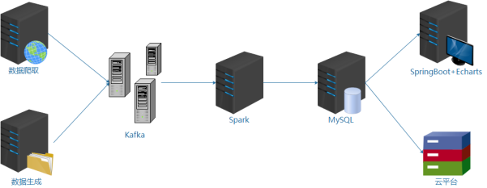

## HttpClient + Jsoup    爬虫，数据爬取解析

HttpClient：数据爬取   Jsoup：数据解析

## Kafka

数据实时的发送给Kafka，由Kafka做一个消息队列的缓冲

## Spark Streaming

Spark对Kafka的消息进行实时的消费，并进行实时的数据处理分析

## MySQL

将处理好的数据存入MySQL中

## Spring Boot

使用web平台

## Echarts

可视化的图表展示

