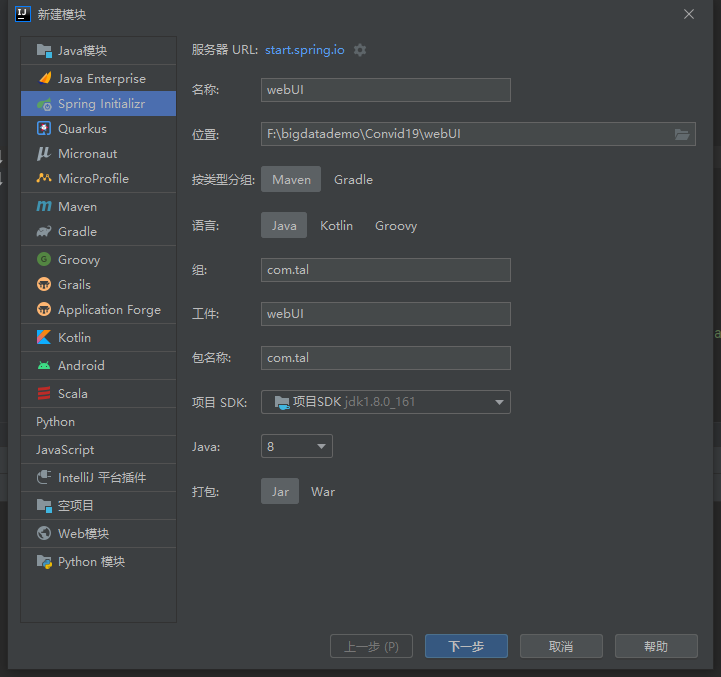
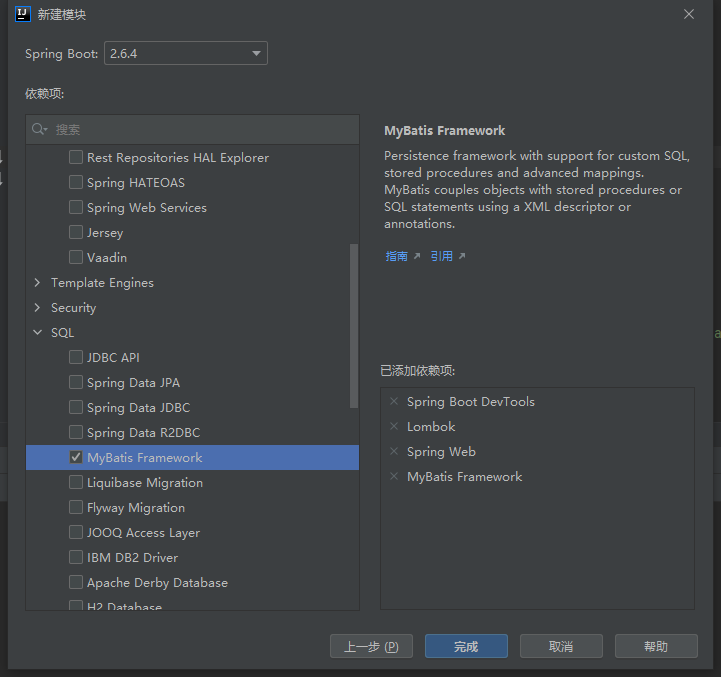
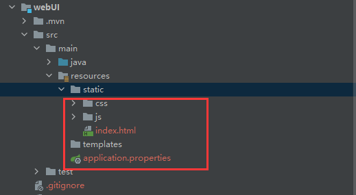
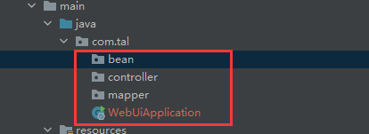
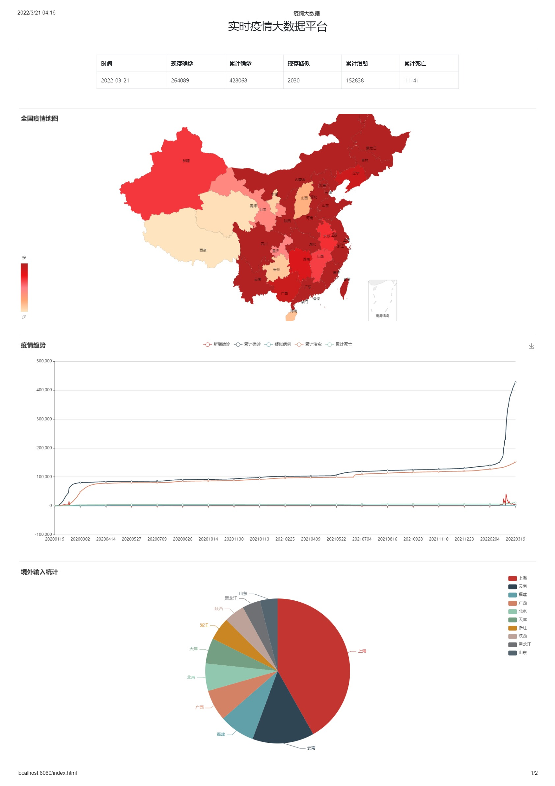

## 环境搭建

新建springboot子模块





导入静态资源模板到static文件夹下





## Echarts可视化实现

https://echarts.apache.org/handbook/zh/get-started/

https://www.runoob.com/echarts/echarts-tutorial.html

Controller

```java
package com.tal.controller;
/* 
    @TODO: 用来接收前端数据请求的Controller
    @Author tal
*/

import com.tal.bean.Result;
import com.tal.mapper.CovidMapper;
import org.apache.commons.lang3.time.FastDateFormat;
import org.springframework.beans.factory.annotation.Autowired;
import org.springframework.web.bind.annotation.RequestMapping;
import org.springframework.web.bind.annotation.RestController;

import java.util.List;
import java.util.Map;

import java.util.Map;

@RestController  // =@Controller + @ResponseBody // 表示该类是SpringBoot的一个Controller ，且返回的数据为JSON格式
@RequestMapping("covid")
public class Covid19Controller {

    @Autowired
    private CovidMapper covidMapper;

    /**
     * 接收前端请求返回全国疫情汇总数据
     */
    @RequestMapping("getNationalData")
    public Result getNationalData(){
        String datetime = FastDateFormat.getInstance("yyyy-MM-dd").format(System.currentTimeMillis());
        Map<String, Object> data = covidMapper.getNationalData(datetime).get(0);
        Result result = Result.success(data);
        return result;
    }

    //getNationalMapData
    /**
     * 查询全国各省份累计确诊数据并返回
     */
    @RequestMapping("getNationalMapData")
    public Result getNationalMapData(){
        String datetime = FastDateFormat.getInstance("yyyy-MM-dd").format(System.currentTimeMillis());
        List<Map<String, Object>> data =  covidMapper.getNationalMapData(datetime);
        return Result.success(data);
    }


    //getCovidTimeData
    /**
     * 查询全国每一天的疫情数据并返回
     */
    @RequestMapping("getCovidTimeData")
    public Result getCovidTimeData(){
        List<Map<String, Object>> data =  covidMapper.getCovidTimeData();
        return Result.success(data);
    }


    //getCovidImportData
    /**
     * 查询各省份境外输入病例数量
     */
    @RequestMapping("getCovidImportData")
    public Result getCovidImportData(){
        String datetime = FastDateFormat.getInstance("yyyy-MM-dd").format(System.currentTimeMillis());
        List<Map<String, Object>> data = covidMapper.getCovidImportData(datetime);
        return  Result.success(data);
    }

    //getCovidWz
    /**
     * 查询各物资使用情况
     */
    @RequestMapping("getCovidWz")
    public Result getCovidWz(){
        List<Map<String, Object>> data = covidMapper.getCovidWz();
        return Result.success(data);
    }

}

```

Mapper

```java
package com.tal.mapper;
/* 
    @TODO: 
    @Author tal
*/

import org.apache.ibatis.annotations.Mapper;
import org.apache.ibatis.annotations.Select;
import org.springframework.stereotype.Component;

import java.util.List;
import java.util.Map;

@Mapper
@Component
public interface CovidMapper {

    /**
     * 查询全国疫情汇总数据
     * @param datetime
     * @return
     */
    @Select("select `datetime`, `currentConfirmedCount`, `confirmedCount`, `suspectedCount`, `curedCount`, `deadCount` from covid19_1 where datetime = #{datetime}")
    List<Map<String,Object>> getNationalData(String datetime);


    /**
     * 查询全国各省份疫情累计确诊数据
     * @param datetime
     * @return 省份名称,累计确诊数
     */
    @Select("select provinceShortName as name ,confirmedCount as value from covid19_2 where datetime = #{datetime}")
    List<Map<String, Object>> getNationalMapData(String datetime);

    /**
     * 查询全国每一天的疫情数据
     * @return
     */
    //'新增确诊', '累计确诊', '疑似病例', '累计治愈', '累计死亡'
    @Select("select dateId,confirmedIncr as `新增确诊`,confirmedCount as `累计确诊`,suspectedCount as `疑似病例`,curedCount as `累计治愈`,deadCount as `累计死亡` from covid19_3")
    List<Map<String, Object>> getCovidTimeData();

    /**
     * 查询全国各省份境外输入病例数量
     * @param datetime
     * @return
     */
    @Select("select provinceShortName as `name`,confirmedCount as `value` from covid19_4 where datetime = #{datetime} order by `value` desc limit 10")
    List<Map<String, Object>> getCovidImportData(String datetime);

    /**
     * 查询防疫物资使用情况
     * @return
     */
    //INSERT INTO `bigdata`.`covid19_wz` (`name`, `cg`, `xb`, `jz`, `xh`, `xq`, `kc`)
    //'name', '采购', '下拨', '捐赠', '消耗', '需求', '库存'
    @Select("select name , `cg` as `采购`, `xb` as `下拨`, `jz` as `捐赠`, `xh` as `消耗`, `xq` as `需求`, `kc` as `库存` from covid19_wz")
    List<Map<String, Object>> getCovidWz();

}

```

bean

```java
package com.tal.bean;
/* 
    @TODO: 封装相应给前端数据的JavaBean（Controller会将该JavaBean转为JSON，前端要求该JSON中有data字段）
    @Author tal
*/

import lombok.AllArgsConstructor;
import lombok.Data;
import lombok.NoArgsConstructor;

@Data
@NoArgsConstructor
@AllArgsConstructor
public class Result {
    private Object data;
    private Integer code;
    private String message;

    public static Result success(Object data){
        Result result = new Result();
        result.setCode(200);
        result.setMessage("success");
        result.setData(data);
        return result;
    }

    public static Result fail(){
        Result result = new Result();
        result.setCode(500);
        result.setMessage("fail");
        result.setData(null);
        return result;
    }
}

```

application.properties

```properties
spring.datasource.driverClassName = com.mysql.jdbc.Driver
spring.datasource.url = jdbc:mysql://localhost:3306/bigdata1?serverTimezone=UTC&useUnicode=true&characterEncoding=utf-8
spring.datasource.username = root
spring.datasource.password = root

```

成品展示

