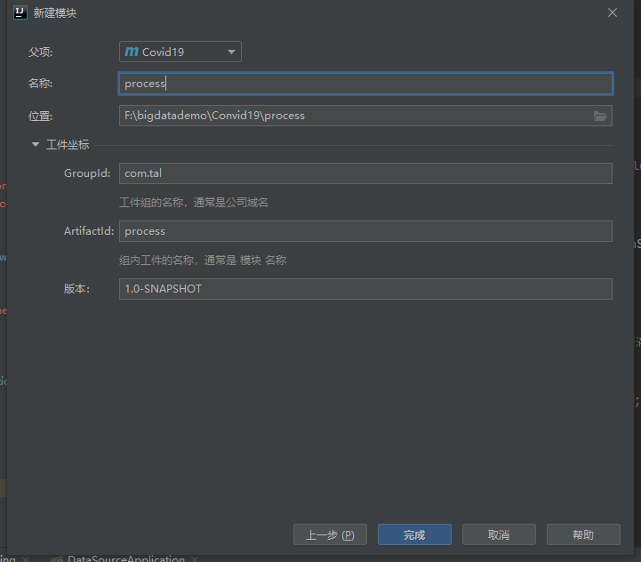
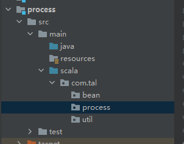
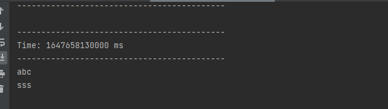
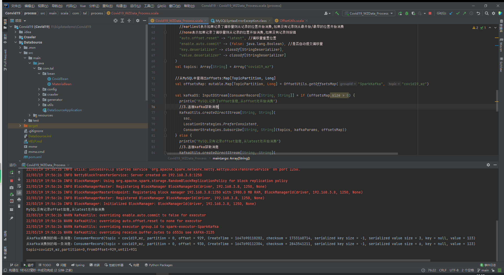

环境准备

新建一个子模块，



pom.xml

```xml
<?xml version="1.0" encoding="UTF-8"?>
<project xmlns="http://maven.apache.org/POM/4.0.0"
         xmlns:xsi="http://www.w3.org/2001/XMLSchema-instance"
         xsi:schemaLocation="http://maven.apache.org/POM/4.0.0 http://maven.apache.org/xsd/maven-4.0.0.xsd">
    <parent>
        <artifactId>Covid19</artifactId>
        <groupId>com.tal</groupId>
        <version>1.0-SNAPSHOT</version>
    </parent>
    <modelVersion>4.0.0</modelVersion>

    <artifactId>process</artifactId>


    <properties>
        <maven.compiler.source>1.8</maven.compiler.source>
        <maven.compiler.target>1.8</maven.compiler.target>
        <encoding>UTF-8</encoding>
        <scala.version>2.11.8</scala.version>
        <spark.version>2.2.0</spark.version>
    </properties>

    <dependencies>
        <dependency>
            <groupId>org.scala-lang</groupId>
            <artifactId>scala-library</artifactId>
            <version>${scala.version}</version>
        </dependency>
        <dependency>
            <groupId>org.apache.spark</groupId>
            <artifactId>spark-core_2.11</artifactId>
            <version>${spark.version}</version>
        </dependency>
        <dependency>
            <groupId>org.apache.spark</groupId>
            <artifactId>spark-sql_2.11</artifactId>
            <version>${spark.version}</version>
        </dependency>
        <dependency>
            <groupId>org.apache.spark</groupId>
            <artifactId>spark-streaming_2.11</artifactId>
            <version>${spark.version}</version>
        </dependency>
        <dependency>
            <groupId>org.apache.spark</groupId>
            <artifactId>spark-streaming-kafka-0-10_2.11</artifactId>
            <version>${spark.version}</version>
        </dependency>
        <dependency>
            <groupId>org.apache.spark</groupId>
            <artifactId>spark-sql-kafka-0-10_2.11</artifactId>
            <version>${spark.version}</version>
        </dependency>
        <dependency>
            <groupId>com.typesafe</groupId>
            <artifactId>config</artifactId>
            <version>1.3.3</version>
        </dependency>
        <dependency>
            <groupId>mysql</groupId>
            <artifactId>mysql-connector-java</artifactId>
            <version>5.1.38</version>
        </dependency>
        <dependency>
            <groupId>com.alibaba</groupId>
            <artifactId>fastjson</artifactId>
            <version>1.2.44</version>
        </dependency>
    </dependencies>
    <build>
        <sourceDirectory>src/main/scala</sourceDirectory>
        <plugins>
            <!-- 指定编译java的插件 -->
            <plugin>
                <groupId>org.apache.maven.plugins</groupId>
                <artifactId>maven-compiler-plugin</artifactId>
                <version>3.5.1</version>
            </plugin>
            <!-- 指定编译scala的插件 -->
            <plugin>
                <groupId>net.alchim31.maven</groupId>
                <artifactId>scala-maven-plugin</artifactId>
                <version>3.2.2</version>
                <executions>
                    <execution>
                        <goals>
                            <goal>compile</goal>
                            <goal>testCompile</goal>
                        </goals>
                        <configuration>
                            <args>
                                <arg>-dependencyfile</arg>
                                <arg>${project.build.directory}/.scala_dependencies</arg>
                            </args>
                        </configuration>
                    </execution>
                </executions>
            </plugin>
            <plugin>
                <groupId>org.apache.maven.plugins</groupId>
                <artifactId>maven-surefire-plugin</artifactId>
                <version>2.22.2</version>
                <configuration>
                    <useFile>false</useFile>
                    <disableXmlReport>true</disableXmlReport>
                    <includes>
                        <include>**/*Test.*</include>
                        <include>**/*Suite.*</include>
                    </includes>
                </configuration>
            </plugin>
            <plugin>
                <groupId>org.apache.maven.plugins</groupId>
                <artifactId>maven-shade-plugin</artifactId>
                <version>2.3</version>
                <executions>
                    <execution>
                        <phase>package</phase>
                        <goals>
                            <goal>shade</goal>
                        </goals>
                        <configuration>
                            <filters>
                                <filter>
                                    <artifact>*:*</artifact>
                                    <excludes>
                                        <exclude>META-INF/*.SF</exclude>
                                        <exclude>META-INF/*.DSA</exclude>
                                        <exclude>META-INF/*.RSA</exclude>
                                    </excludes>
                                </filter>
                            </filters>
                            <transformers>
                                <transformer
                                        implementation="org.apache.maven.plugins.shade.resource.ManifestResourceTransformer">
                                    <mainClass></mainClass>
                                </transformer>
                            </transformers>
                        </configuration>
                    </execution>
                </executions>
            </plugin>
        </plugins>
    </build>

</project>
```

新建一个scala文件夹，并设为source root

新建文件路径备用



## 物资实时处理与分析

新建Covid19_WZData_Process.scala

### 整合kafka自动偏移量

```scala
package com.tal.process

import org.apache.kafka.clients.consumer.ConsumerRecord
import org.apache.kafka.common.serialization.StringDeserializer
import org.apache.spark.streaming.dstream.{DStream, InputDStream}
import org.apache.spark.streaming.kafka010.{ConsumerStrategies, KafkaUtils, LocationStrategies}
import org.apache.spark.streaming.{Seconds, StreamingContext}
import org.apache.spark.{SparkConf, SparkContext}

/*
    @TODO: 疫情物资数据实时处理与分析
    @Author tal
*/

object Covid19_WZData_Process {
  def main(args: Array[String]): Unit = {
    // 1、准备SparkStreaming的开发环境
    val conf : SparkConf = new SparkConf().setAppName("Covid19_WZData_Process").setMaster("local[*]")
    val sc: SparkContext = new SparkContext(conf)
    sc.setLogLevel("WARN")
    val ssc: StreamingContext = new StreamingContext(sc, Seconds(5))
    ssc.checkpoint("./sscckp")

    /*
    补充知识点:SparkStreaming整合Kafka的两种方式:
    1.Receiver模式
    KafkaUtils.creatDStream--API创建
    会有一个Receiver作为常驻Task运行在Executor进程中,一直等待数据的到来
    一个Receiver效率会比较低,那么可以使用多个Receiver,但是多个Receiver中的数据又需要手动进行Union(合并)很麻烦
    且其中某个Receiver挂了,会导致数据丢失,需要开启WAL预写日志来保证数据安全,但是效率又低了
    Receiver模式使用Zookeeper来连接Kafka(Kafka的新版本中已经不推荐使用该方式了)
    Receiver模式使用的是Kafka的高阶API(高度封装的),offset由Receiver提交到ZK中(Kafka的新版本中offset默认存储在默认主题
     __consumer__offset中的,不推荐存入到ZK中了),容易和Spark维护在Checkpoint中的offset不一致
    所以不管从何种角度去说Receiver模式都已经不再适合现如今的Kafka版本了,面试的时候要说出以上的因为!

    2.Direct模式
    KafkaUtils.createDirectStream--API创建
    Direct模式是直接连接到Kafka的各个分区,并拉取数据,提高了数据读取的并发能力
    Direct模式使用的是Kafka低阶API(底层API),可以自己维护偏移量到任何地方
    (默认是由Spark提交到默认主题/Checkpoint)
    Direct模式+手动操作可以保证数据的Exactly-Once精准一次(数据仅会被处理一次)

    补充知识点:SparkStreaming整合Kafka的两个版本的API
    Spark-streaming-kafka-0-8
    支持Receiver模式和Direct模式,但是不支持offset维护API,不支持动态分区订阅..

    Spark-streaming-kafka-0-10
    支持Direct,不支持Receiver模式,支持offset维护API,支持动态分区订阅..
    结论:使用Spark-streaming-kafka-0-10版本即可
    */

    // 2、准备kafka的连接参数
    val kafkaParams: Map[String, Object] = Map[String, Object](
      "bootstrap.servers" -> "master:9092,slave1:9092,slave2:9092", //kafka集群地址
      "group.id" -> "SparkKafka",
      //latest表示如果记录了偏移量则从记录的位置开始消费,如果没有记录则从最新/最后的位置开始消费
      //earliest表示如果记录了偏移量则从记录的位置开始消费,如果没有记录则从最开始/最早的位置开始消费
      //none表示如果记录了偏移量则从记录的位置开始消费,如果没有记录则报错
      "auto.offset.reset" -> "latest", //偏移量重置位置
      "enable.auto.commit" -> (true: java.lang.Boolean), //是否自动提交偏移量
      "key.deserializer" -> classOf[StringDeserializer],
      "value.deserializer" -> classOf[StringDeserializer]
    )
    val topics: Array[String] = Array("covid19_wz")


    // 3、连接kafka消费数据
    val kafkaDS: InputDStream[ConsumerRecord[String,String]]= KafkaUtils.createDirectStream[String, String](ssc,
      LocationStrategies.PreferConsistent,
      ConsumerStrategies.Subscribe[String, String](topics, kafkaParams))


    // 4、实时处理数据
    val valueDS: DStream[String] = kafkaDS.map(_.value())  //下划线表示从kafka中消费出来的每一条消息
    valueDS.print()


    // 5、将处理分析的结果存入到MySQL

    // 6、开启SparkStreaming任务并等待结束
    ssc.start()
    ssc.awaitTermination()

  }

}

```

kafka连接测试

```shell
kafka-console-producer.sh --broker-list master:9092 --topic covid19_wz
```



### 整合kafka手动维护偏移量

```scala
// 4、实时处理数据并手动提交偏移量
    /*val valueDS: DStream[String] = kafkaDS.map(_.value())  //下划线表示从kafka中消费出来的每一条消息
    valueDS.print()*/
    // 手动提交偏移量，消费一批数据就应该提交一次偏移量
    // 在SparkStreaming中数据抽象为DStream,DStream的底层是RDD，也就是每一批次的数据
    // 即接下来对DStream的RDD进行处理
    kafkaDS.foreachRDD(rdd=>{
      if(rdd.count()>0){      // 如果RDD中有数据则处理
        rdd.foreach(record=>println("从kafka消费到的每一条消息："+record))
        // 从kafka消费到的每一条消息：ConsumerRecord(topic = covid19_wz, partition = 0, offset = 913, CreateTime = 1647661494457, checksum = 2246675365, serialized key size = -1, serialized value size = 3, key = null, value = asd)
        // 获取偏移量
        // 使用Spark-streaming-kafka-0-10中封装好的API来存放偏移量并提交
        val offsets:Array[OffsetRange] = rdd.asInstanceOf[HasOffsetRanges].offsetRanges
        for( o <- offsets){
          println(s"topic=${o.topic},partition=${o.partition},fromOffset=${o.fromOffset},until=${o.untilOffset}")
          // topic=covid19_wz,partition=0,fromOffset=917,until=918
        }
        // 手动提交偏移量到kafka的默认主题: ——consumer_offsets中，如果开启了Checkpoint还会提交到Checkpoint中
        kafkaDS.asInstanceOf[CanCommitOffsets].commitAsync(offsets)
      }
    })

```

遇见问题

```shell
You have an error in your SQL syntax; check the manual that corresponds to your MySQL server version for the right syntax to use near 'partition, ...
```

原因是partition 是MySQL的关键字，不能拿来做键值

新建Offset Utils工具类

```scala
package com.tal.util


import org.apache.kafka.common.TopicPartition
import org.apache.spark.streaming.kafka010.OffsetRange

import java.sql.{Connection, DriverManager, PreparedStatement, ResultSet}

import scala.collection.mutable

/*
    @TODO: 用来手动维护偏移量到MySQL中的工具类
    @Author tal
*/

object OffsetUtils {
  /**
   * 根据参数查询偏移量信息并封装成Map返回
   * @param groupId 消费者组名称
   * @param topic   主题
   * @return        偏移量信息封装成的Map
   */

  def getOffsetsMap(groupId: String, topic: String): mutable.Map[TopicPartition, Long] = {
    //1.获取连接
    val conn: Connection = DriverManager.getConnection("jdbc:mysql://localhost:3306/bigdata1?characterEncoding=UTF-8","root","root")
    //2.编写sql
    val sql:String = "select par, offset from t_offset where groupid = ? and topic = ?"
    //3.获取ps
    val ps: PreparedStatement = conn.prepareStatement(sql)
    //4.设置参数并执行
    ps.setString(1,groupId)
    ps.setString(2,topic)
    val rs: ResultSet = ps.executeQuery()
    //5.获取返回值并封装成Map
    val offsetsMap:mutable.Map[TopicPartition, Long] = mutable.Map[TopicPartition, Long]()
    while(rs.next()){
      val partition: Int = rs.getInt("partition")
      val offset: Int = rs.getInt("offset")
      offsetsMap += new TopicPartition(topic,partition) -> offset
    }

    //6.关闭资源
    rs.close()
    ps.close()
    conn.close()
    //7.返回Map
    offsetsMap
  }

  /**
   * 将消费者组的偏移量信息存入到MySQL
   * @param groupId 消费者组名称
   * @param offsets 偏移量信息
   */

  /*
  CREATE TABLE `t_offset` (
    `topic` varchar(255) NOT NULL,
    `partition` int(11) NOT NULL,
    `groupid` varchar(255) NOT NULL,
    `offset` bigint(20) DEFAULT NULL,
    PRIMARY KEY (`topic`,`partition`,`groupid`)
  ) ENGINE=InnoDB DEFAULT CHARSET=utf8;
  */
  def saveOffsets(groupId: String, offsets: Array[OffsetRange]):Unit = {
    //1.获取连接
    val conn: Connection = DriverManager.getConnection("jdbc:mysql://localhost:3306/bigdata1?characterEncoding=UTF-8","root","root")
    //2.编写sql
    val sql:String = "replace into t_offset (topic, partition, groupid, offset) values(?,?,?,?)"
    //3.创建预编译语句对象
    val ps: PreparedStatement = conn.prepareStatement(sql)
    //4.设置参数并执行
    for(o <- offsets){
      ps.setString(1,o.topic)
      ps.setInt(2,o.partition)
      ps.setString(3,groupId)
      ps.setLong(4,o.untilOffset)   //消费到哪，下次继续
      ps.executeUpdate()
    }
    //5.关闭资源
    ps.close()
    conn.close()

  }

}

```

手动维护方式更改

```scala
    val kafkaDS: InputDStream[ConsumerRecord[String, String]] = if (offsetsMap.size > 0) {
      println("MySQL记录了offset信息,从offset处开始消费")
      //3.连接kafka获取消息
      KafkaUtils.createDirectStream[String, String](
        ssc,
        LocationStrategies.PreferConsistent,
        ConsumerStrategies.Subscribe[String, String](topics, kafkaParams, offsetsMap))
    } else {
      println("MySQL没有记录offset信息,从latest处开始消费")
      //3.连接kafka获取消息
      KafkaUtils.createDirectStream[String, String](
        ssc,
        LocationStrategies.PreferConsistent,
        ConsumerStrategies.Subscribe[String, String](topics, kafkaParams))
    }


    // 4、实时处理数据并手动提交偏移量
    /*val valueDS: DStream[String] = kafkaDS.map(_.value())  //下划线表示从kafka中消费出来的每一条消息
    valueDS.print()*/
    // 手动提交偏移量，消费一批数据就应该提交一次偏移量
    // 在SparkStreaming中数据抽象为DStream,DStream的底层是RDD，也就是每一批次的数据
    // 即接下来对DStream的RDD进行处理
    kafkaDS.foreachRDD(rdd=>{
      if(rdd.count()>0){      // 如果RDD中有数据则处理
        rdd.foreach(record=>println("从kafka消费到的每一条消息："+record))
        // 从kafka消费到的每一条消息：ConsumerRecord(topic = covid19_wz, partition = 0, offset = 913, CreateTime = 1647661494457, checksum = 2246675365, serialized key size = -1, serialized value size = 3, key = null, value = asd)
        // 获取偏移量
        // 使用Spark-streaming-kafka-0-10中封装好的API来存放偏移量并提交
        val offsets:Array[OffsetRange] = rdd.asInstanceOf[HasOffsetRanges].offsetRanges
        for( o <- offsets){
          println(s"topic=${o.topic},partition=${o.partition},fromOffset=${o.fromOffset},until=${o.untilOffset}")
          // topic=covid19_wz,partition=0,fromOffset=917,until=918
        }
        // 手动提交偏移量到kafka的默认主题: ——consumer_offsets中，如果开启了Checkpoint还会提交到Checkpoint中
        kafkaDS.asInstanceOf[CanCommitOffsets].commitAsync(offsets)
      }
    })

```




### 剩余操作（数据格式转换、数据聚合、统计结果存储）

```scala
package com.tal.process


import com.alibaba.fastjson.{JSON, JSONObject}
import com.tal.util.OffsetUtils
import org.apache.kafka.clients.consumer.ConsumerRecord
import org.apache.kafka.common.TopicPartition
import org.apache.kafka.common.serialization.StringDeserializer
import org.apache.spark.streaming.dstream.{DStream, InputDStream}
import org.apache.spark.streaming.kafka010.{CanCommitOffsets, ConsumerStrategies, HasOffsetRanges, KafkaUtils, LocationStrategies, OffsetRange}
import org.apache.spark.streaming.{Seconds, StreamingContext}
import org.apache.spark.{SparkConf, SparkContext}

import java.sql.{Connection, DriverManager, PreparedStatement}
import scala.collection.mutable

/*
    @TODO: 疫情物资数据实时处理与分析
    @Author tal
*/

object Covid19_WZData_Process {
  def main(args: Array[String]): Unit = {
    // 1、准备SparkStreaming的开发环境
    val conf : SparkConf = new SparkConf().setAppName("Covid19_WZData_Process").setMaster("local[*]")
    val sc: SparkContext = new SparkContext(conf)
    sc.setLogLevel("WARN")
    val ssc: StreamingContext = new StreamingContext(sc, Seconds(5))
    ssc.checkpoint("./sscckp")

    /*
    补充知识点:SparkStreaming整合Kafka的两种方式:
    1.Receiver模式
    KafkaUtils.creatDStream--API创建
    会有一个Receiver作为常驻Task运行在Executor进程中,一直等待数据的到来
    一个Receiver效率会比较低,那么可以使用多个Receiver,但是多个Receiver中的数据又需要手动进行Union(合并)很麻烦
    且其中某个Receiver挂了,会导致数据丢失,需要开启WAL预写日志来保证数据安全,但是效率又低了
    Receiver模式使用Zookeeper来连接Kafka(Kafka的新版本中已经不推荐使用该方式了)
    Receiver模式使用的是Kafka的高阶API(高度封装的),offset由Receiver提交到ZK中(Kafka的新版本中offset默认存储在默认主题
     __consumer__offset中的,不推荐存入到ZK中了),容易和Spark维护在Checkpoint中的offset不一致
    所以不管从何种角度去说Receiver模式都已经不再适合现如今的Kafka版本了,面试的时候要说出以上的因为!

    2.Direct模式
    KafkaUtils.createDirectStream--API创建
    Direct模式是直接连接到Kafka的各个分区,并拉取数据,提高了数据读取的并发能力
    Direct模式使用的是Kafka低阶API(底层API),可以自己维护偏移量到任何地方
    (默认是由Spark提交到默认主题/Checkpoint)
    Direct模式+手动操作可以保证数据的Exactly-Once精准一次(数据仅会被处理一次)

    补充知识点:SparkStreaming整合Kafka的两个版本的API
    Spark-streaming-kafka-0-8
    支持Receiver模式和Direct模式,但是不支持offset维护API,不支持动态分区订阅..

    Spark-streaming-kafka-0-10
    支持Direct,不支持Receiver模式,支持offset维护API,支持动态分区订阅..
    结论:使用Spark-streaming-kafka-0-10版本即可
    */

    // 2、准备kafka的连接参数
    val kafkaParams: Map[String, Object] = Map[String, Object](
      "bootstrap.servers" -> "master:9092,slave1:9092,slave2:9092", //kafka集群地址
      "group.id" -> "SparkKafka",
      //latest表示如果记录了偏移量则从记录的位置开始消费,如果没有记录则从最新/最后的位置开始消费
      //earliest表示如果记录了偏移量则从记录的位置开始消费,如果没有记录则从最开始/最早的位置开始消费
      //none表示如果记录了偏移量则从记录的位置开始消费,如果没有记录则报错
      "auto.offset.reset" -> "latest", //偏移量重置位置
      "enable.auto.commit" -> (false: java.lang.Boolean), //是否自动提交偏移量
      "key.deserializer" -> classOf[StringDeserializer],
      "value.deserializer" -> classOf[StringDeserializer]
    )
    val topics: Array[String] = Array("covid19_wz")

    //从MySQL中查询出offsets:Map[TopicPartition, Long]
    val offsetsMap: mutable.Map[TopicPartition, Long] = OffsetUtils.getOffsetsMap("SparkKafka", "covid19_wz")

    val kafkaDS: InputDStream[ConsumerRecord[String, String]] = if (offsetsMap.size > 0) {
      println("MySQL记录了offset信息,从offset处开始消费")
      //3.连接kafka获取消息
      KafkaUtils.createDirectStream[String, String](
        ssc,
        LocationStrategies.PreferConsistent,
        ConsumerStrategies.Subscribe[String, String](topics, kafkaParams, offsetsMap))
    } else {
      println("MySQL没有记录offset信息,从latest处开始消费")
      //3.连接kafka获取消息
      KafkaUtils.createDirectStream[String, String](
        ssc,
        LocationStrategies.PreferConsistent,
        ConsumerStrategies.Subscribe[String, String](topics, kafkaParams))
    }


    // 4、实时处理数据并手动提交偏移量
    //val valueDS: DStream[String] = kafkaDS.map(_.value())//_表示从Kafka中消费出来的每一条消息
    //valueDS.print()

    /*需求分析:
    {"count":673,"from":"消耗","name":"N95口罩/个"}
    {"count":207,"from":"下拨","name":"医用防护服/套"}
    {"count":802,"from":"捐赠","name":"医用防护服/套"}
    {"count":870,"from":"需求","name":"护目镜/副"}
    {"count":774,"from":"消耗","name":"医用防护服/套"}
    {"count":439,"from":"下拨","name":"电子体温计/个"}
    {"count":642,"from":"捐赠","name":"医用防护服/套"}
    {"count":105,"from":"采购","name":"医用外科口罩/个"}
    {"count":829,"from":"消耗","name":"84消毒液/瓶"}
    {"count":254,"from":"捐赠","name":"一次性手套/副"}
    我们从Kafka中消费的数据为如上格式的jsonStr,需要解析为json对象(或者是样例类)
    目标是:将数据转为如下格式:
    名称,采购,下拨,捐赠,消耗,需求,库存
    N95口罩/个,1000,1000,500,-1000,-1000,500
    护目镜/副,500,300,100,-400,-100,400
    为了达成目标结果格式,我们需要对每一条数据进行处理,得出如下格式:
    (name,(采购,下拨,捐赠,消耗,需求,库存))
    如:接收到一条数据为:
    {"count":673,"from":"消耗","name":"N95口罩/个"}
    应该记为:
    (N95口罩/个,(采购0,下拨0,捐赠0,消耗-673,需求0,库存-673))
    再来一条数据:
    {"count":500,"from":"采购","name":"N95口罩/个"}
    应该记为:
    (N95口罩/个,(采购500,下拨0,捐赠0,消耗0,需求0,库存500))
    最后聚合结果:
    (N95口罩/个,(采购500,下拨0,捐赠0,消耗-673,需求0,库存-173))*/


    //4.1将接收到的数据转换为需要的元组格式:(name,(采购,下拨,捐赠,消耗,需求,库存))
    val tupleDS: DStream[(String, (Int, Int, Int, Int, Int, Int))] = kafkaDS.map(record => {
      val jsonStr: String = record.value()
      val jsonObj: JSONObject = JSON.parseObject(jsonStr)
      val name: String = jsonObj.getString("name")
      val from: String = jsonObj.getString("from")
      val count: Int = jsonObj.getInteger("count")
      //根据物资来源不同,将count记在不同的位置,最终形成统一的格式
      from match {
        case "采购" => (name, (count, 0, 0, 0, 0, count))
        case "下拨" => (name, (0, count, 0, 0, 0, count))
        case "捐赠" => (name, (0, 0, count, 0, 0, count))
        case "消耗" => (name, (0, 0, 0, -count, 0, -count))
        case "需求" => (name, (0, 0, 0, 0, -count, -count))
      }
    })
   /* tupleDS.print()
    (N95口罩/个,(0,0,0,0,-784,-784))
    (N95口罩/个,(0,0,0,0,-755,-755))
    (医用防护服/套,(0,0,0,0,-899,-899))
    (护目镜/副,(0,0,0,0,-154,-154))
    (电子体温计/个,(0,0,0,0,-658,-658))
    (护目镜/副,(230,0,0,0,0,230))
    (84消毒液/瓶,(0,0,0,0,-274,-274))
    (N95口罩/个,(0,752,0,0,0,752))
    (电子体温计/个,(0,0,0,-240,0,-240))
    (电子体温计/个,(0,0,0,0,-980,-980))*/

    //4.2将上述格式的数据按照key进行聚合(有状态的计算)--使用updateStateBykey
    //定义一个函数,用来将当前批次的数据和历史数据进行聚合
    val updateFunc = (currentValues: Seq[(Int, Int, Int, Int, Int, Int)], historyValue: Option[(Int, Int, Int, Int, Int, Int)]) => {
      //0.定义变量用来接收当前批次数据(采购,下拨,捐赠,消耗,需求,库存)
      var current_cg: Int = 0
      var current_xb: Int = 0
      var current_jz: Int = 0
      var current_xh: Int = 0
      var current_xq: Int = 0
      var current_kc: Int = 0
      if (currentValues.size > 0) {
        //1.取出当前批次数据
        for (currentValue <- currentValues) {
          current_cg += currentValue._1
          current_xb += currentValue._2
          current_jz += currentValue._3
          current_xh += currentValue._4
          current_xq += currentValue._5
          current_kc += currentValue._6
        }
        //2.取出历史数据
        val history_cg: Int = historyValue.getOrElse((0, 0, 0, 0, 0, 0))._1
        val history_xb: Int = historyValue.getOrElse((0, 0, 0, 0, 0, 0))._2
        val history_jz: Int = historyValue.getOrElse((0, 0, 0, 0, 0, 0))._3
        val history_xh: Int = historyValue.getOrElse((0, 0, 0, 0, 0, 0))._4
        val history_xq: Int = historyValue.getOrElse((0, 0, 0, 0, 0, 0))._5
        val history_kc: Int = historyValue.getOrElse((0, 0, 0, 0, 0, 0))._6

        //3.将当前批次数据和历史数据进行聚合
        val result_cg: Int = current_cg + history_cg
        val result_xb: Int = current_xb + history_xb
        val result_jz: Int = current_jz + history_jz
        val result_xh: Int = current_xh + history_xh
        val result_xq: Int = current_xq + history_xq
        val result_kc: Int = current_kc + history_kc

        //4.将聚合结果进行返回
        Some((
          result_cg,
          result_xb,
          result_jz,
          result_xh,
          result_xq,
          result_kc))
      } else {
        historyValue
      }
    }
    val resultDS: DStream[(String, (Int, Int, Int, Int, Int, Int))] = tupleDS.updateStateByKey(updateFunc)
    //resultDS.print()


    //5.将处理分析的结果存入到MySQL
    /*
CREATE TABLE `covid19_wz` (
  `name` varchar(12) NOT NULL DEFAULT '',
  `cg` int(11) DEFAULT '0',
  `xb` int(11) DEFAULT '0',
  `jz` int(11) DEFAULT '0',
  `xh` int(11) DEFAULT '0',
  `xq` int(11) DEFAULT '0',
  `kc` int(11) DEFAULT '0',
  PRIMARY KEY (`name`)
) ENGINE=InnoDB DEFAULT CHARSET=utf8;
     */
    resultDS.foreachRDD(rdd => {
      rdd.foreachPartition(lines => {
        //1.开启连接
        val conn: Connection = DriverManager.getConnection("jdbc:mysql://localhost:3306/bigdata1?characterEncoding=UTF-8", "root", "root")
        //2.编写sql并获取ps
        val sql: String = "replace into covid19_wz(name,cg,xb,jz,xh,xq,kc) values(?,?,?,?,?,?,?)"
        val ps: PreparedStatement = conn.prepareStatement(sql)
        //3.设置参数并执行
        for (line <- lines) {
          ps.setString(1,line._1)
          ps.setInt(2,line._2._1)
          ps.setInt(3,line._2._2)
          ps.setInt(4,line._2._3)
          ps.setInt(5,line._2._4)
          ps.setInt(6,line._2._5)
          ps.setInt(7,line._2._6)
          ps.executeUpdate()
        }
        //4.关闭资源
        ps.close()
        conn.close()
      })
    })

    // 6、开启SparkStreaming任务并等待结束
    ssc.start()
    ssc.awaitTermination()
  }
}
```

## 疫情数据实时处理与分析

新建疫情数据分析类

```scala
package com.tal.process

import com.alibaba.fastjson.JSON
import com.tal.bean.{CovidBean, StatisticsDataBean}
import com.tal.util.BaseJdbcSink
import org.apache.spark.SparkContext
import org.apache.spark.sql.streaming.Trigger
import org.apache.spark.sql.{DataFrame, Dataset, Row, SparkSession}

import scala.collection.immutable.StringOps
import scala.collection.mutable

/*
    @TODO: 全国各省市疫情数据实时处理统计分析
    @Author tal
*/

object Covid19_Data_Process {
  def main(args: Array[String]): Unit = {
    //1.创建StructuredStreaming执行环境
    //StructuredStreaming支持使用SQL来处理实时流数据,数据抽象和SparkSQL一样,也是DataFrame和DataSet
    //所以这里创建StructuredStreamin执行环境就直接创建SparkSession即可
    val spark: SparkSession = SparkSession.builder().master("local[*]").appName("Covid19_Data_Process").getOrCreate()
    val sc: SparkContext = spark.sparkContext
    sc.setLogLevel("WARN")
    //导入隐式转换方便后续使用
    import org.apache.spark.sql.functions._
    import spark.implicits._

    import scala.collection.JavaConversions._

    //2.连接Kafka
    //从kafka接收消息
    val kafkaDF: DataFrame = spark.readStream
      .format("kafka")
      .option("kafka.bootstrap.servers", "master:9092,slave1:9092,slave2:9092")
      .option("subscribe", "covid19")
      .load()
    //取出消息中的value
    val jsonStrDS: Dataset[String] = kafkaDF.selectExpr("CAST(value AS STRING)").as[String]
    /*jsonStrDS.writeStream
      .format("console")//输出目的地
      .outputMode("append")//输出模式,默认就是append表示显示新增行
      .trigger(Trigger.ProcessingTime(0))//触发间隔,0表示尽可能快的执行
      .option("truncate",false)//表示如果列名过长不进行截断
      .start()
      .awaitTermination()*/

    //3.处理数据
    //将jsonStr转为样例类
    val covidBeanDS: Dataset[CovidBean] = jsonStrDS.map(jsonStr => {
      //注意:Scala中获取class对象使用classOf[类名]
      //Java中使用类名.class/Class.forName(全类路径)/对象.getClass()
      JSON.parseObject(jsonStr, classOf[CovidBean])
    })
    //分离出省份数据
    val provinceDS: Dataset[CovidBean] = covidBeanDS.filter(_.statisticsData != null)

    //分离出城市数据
    val cityDS: Dataset[CovidBean] = covidBeanDS.filter(_.statisticsData == null)

    //分离出各省份每一天的统计数据
    val statisticsDataDS: Dataset[StatisticsDataBean] = provinceDS.flatMap(p => {
      val jsonStr: StringOps = p.statisticsData //获取到的是该省份每一天的统计数据组成的jsonStr数组
      val list: mutable.Buffer[StatisticsDataBean] = JSON.parseArray(jsonStr, classOf[StatisticsDataBean])
      list.map(s => {
        s.provinceShortName = p.provinceShortName
        s.locationId = p.locationId
        s
      })
    })

    /*statisticsDataDS.writeStream
      .format("console")//输出目的地
      .outputMode("append")//输出模式,默认就是append表示显示新增行
      .trigger(Trigger.ProcessingTime(0))//触发间隔,0表示尽可能快的执行
      .option("truncate",false)//表示如果列名过长不进行截断
      .start()
      .awaitTermination()*/


    //4.统计分析
    //4.1.全国疫情汇总信息:现有确诊,累计确诊,现有疑似,累计治愈,累计死亡--注意:按照日期分组统计
    val result1: DataFrame = provinceDS.groupBy('datetime)
      .agg(sum('currentConfirmedCount) as "currentConfirmedCount",  //现有确诊
        sum('confirmedCount) as "confirmedCount",                   //累计确诊
        sum('suspectedCount) as "suspectedCount",                   //现有疑似
        sum('curedCount) as "curedCount",                           //累计治愈
        sum('deadCount) as "deadCount"                              //累计死亡
      )

    //4.2.全国各省份累计确诊数地图--注意:按照日期-省份分组
    /*cityDS.groupBy('datetime,'provinceShortName)
      .agg(sum('confirmedCount) as "confirmedCount")*/
    val result2: DataFrame = provinceDS.select('datetime,'locationId,'provinceShortName,'currentConfirmedCount,'confirmedCount,'suspectedCount,'curedCount,'deadCount)

    //4.3.全国疫情趋势--注意:按照日期分组聚合
    val result3: DataFrame = statisticsDataDS.groupBy('dateId)
      .agg(
        sum('confirmedIncr) as "confirmedIncr",                     //新增确诊
        sum('confirmedCount) as "confirmedCount",                   //累计确诊
        sum('suspectedCount) as "suspectedCount",                   //现有疑似
        sum('curedCount) as "curedCount",                           //累计治愈
        sum('deadCount) as "deadCount"                              //累计死亡
      )

    //4.4.境外输入排行--注意:按照日期-城市分组聚合
    val result4: Dataset[Row] = cityDS.filter(_.cityName.contains("境外输入"))
      .groupBy('datetime, 'provinceShortName, 'pid)
      .agg(sum('confirmedCount) as "confirmedCount")
      .sort('confirmedCount.desc)

    //4.5.统计湖北省的累计确诊地图
    val result5: DataFrame = cityDS.filter(_.provinceShortName.equals("湖北"))
      .select('datetime,'locationId,'provinceShortName,'cityName,'currentConfirmedCount,'confirmedCount,'suspectedCount,'curedCount,'deadCount)
    //.....


    //5.结果输出--先输出到控制台观察,最终输出到MySQL
    result1.writeStream
      .format("console")
      //输出模式:
      //1.append:默认的,表示只输出新增的数据,只支持简单的查询,不支持聚合
      //2.complete:表示完整模式,所有数据都会输出,必须包含聚合操作
      //3.update:表示更新模式,只输出有变化的数据,不支持排序
      .outputMode("complete")
      .trigger(Trigger.ProcessingTime(0))
      .option("truncate",false)
      .start()
    //.awaitTermination()
    /*

CREATE TABLE `covid19_1` (
  `datetime` varchar(20) NOT NULL DEFAULT '',
  `currentConfirmedCount` bigint(20) DEFAULT '0',
  `confirmedCount` bigint(20) DEFAULT '0',
  `suspectedCount` bigint(20) DEFAULT '0',
  `curedCount` bigint(20) DEFAULT '0',
  `deadCount` bigint(20) DEFAULT '0',
  PRIMARY KEY (`datetime`)
) ENGINE=InnoDB DEFAULT CHARSET=utf8;

     */
    result1.writeStream
      .foreach(new BaseJdbcSink("replace into covid19_1 (datetime,currentConfirmedCount,confirmedCount,suspectedCount,curedCount,deadCount) values(?,?,?,?,?,?)") {
        override def realProcess(sql: String, row: Row): Unit = {
          //取出row中的数据
          val datetime: String = row.getAs[String]("datetime")
          val currentConfirmedCount: Long = row.getAs[Long]("currentConfirmedCount")
          val confirmedCount: Long = row.getAs[Long]("confirmedCount")
          val suspectedCount: Long = row.getAs[Long]("suspectedCount")
          val curedCount: Long = row.getAs[Long]("curedCount")
          val deadCount: Long = row.getAs[Long]("deadCount")
          //获取预编译语句对象
          ps = conn.prepareStatement(sql)
          //给sql设置参数值
          ps.setString(1,datetime)
          ps.setLong(2,currentConfirmedCount)
          ps.setLong(3,confirmedCount)
          ps.setLong(4,suspectedCount)
          ps.setLong(5,curedCount)
          ps.setLong(6,deadCount)
          ps.executeUpdate()
        }
      })
      .outputMode("complete")
      .trigger(Trigger.ProcessingTime(0))
      .option("truncate",false)
      .start()


    result2.writeStream
      .format("console")
      .outputMode("append")
      .trigger(Trigger.ProcessingTime(0))
      .option("truncate",false)
      .start()
    //.awaitTermination()
    /*

CREATE TABLE `covid19_2` (
  `datetime` varchar(20) NOT NULL DEFAULT '',
  `locationId` int(11) NOT NULL DEFAULT '0',
  `provinceShortName` varchar(20) DEFAULT '',
  `cityName` varchar(20) DEFAULT '',
  `currentConfirmedCount` int(11) DEFAULT '0',
  `confirmedCount` int(11) DEFAULT '0',
  `suspectedCount` int(11) DEFAULT '0',
  `curedCount` int(11) DEFAULT '0',
  `deadCount` int(11) DEFAULT '0',
  `pid` int(11) DEFAULT '0',
  PRIMARY KEY (`datetime`,`locationId`)
) ENGINE=InnoDB DEFAULT CHARSET=utf8;
     */
    result2.writeStream
      .foreach(new BaseJdbcSink("replace into covid19_2 (datetime,locationId,provinceShortName,currentConfirmedCount,confirmedCount,suspectedCount,curedCount,deadCount) values(?,?,?,?,?,?,?,?)") {
        override def realProcess(sql: String, row: Row): Unit = {
          val datetime: String = row.getAs[String]("datetime")
          val locationId: Int = row.getAs[Int]("locationId")
          val provinceShortName: String = row.getAs[String]("provinceShortName")
          val currentConfirmedCount: Int = row.getAs[Int]("currentConfirmedCount")
          val confirmedCount: Int = row.getAs[Int]("confirmedCount")
          val suspectedCount: Int = row.getAs[Int]("suspectedCount")
          val curedCount: Int = row.getAs[Int]("curedCount")
          val deadCount: Int = row.getAs[Int]("deadCount")
          ps = conn.prepareStatement(sql)
          ps.setString(1,datetime)
          ps.setInt(2,locationId)
          ps.setString(3,provinceShortName)
          ps.setInt(4,currentConfirmedCount)
          ps.setInt(5,confirmedCount)
          ps.setInt(6,suspectedCount)
          ps.setInt(7,curedCount)
          ps.setInt(8,deadCount)
          ps.executeUpdate()
        }
      })
      .outputMode("append")
      .trigger(Trigger.ProcessingTime(0))
      .option("truncate",false)
      .start()

    result3.writeStream
      .format("console")
      .outputMode("complete")
      .trigger(Trigger.ProcessingTime(0))
      .option("truncate",false)
      .start()
    //.awaitTermination()
    /*

CREATE TABLE `covid19_3` (
  `dateId` varchar(20) NOT NULL DEFAULT '',
  `confirmedIncr` bigint(20) DEFAULT '0',
  `confirmedCount` bigint(20) DEFAULT '0',
  `suspectedCount` bigint(20) DEFAULT '0',
  `curedCount` bigint(20) DEFAULT '0',
  `deadCount` bigint(20) DEFAULT '0',
  PRIMARY KEY (`dateId`)
) ENGINE=InnoDB DEFAULT CHARSET=utf8;
     */
    result3.writeStream
      .foreach(new BaseJdbcSink("replace into covid19_3 (dateId,confirmedIncr,confirmedCount,suspectedCount,curedCount,deadCount) values(?,?,?,?,?,?)") {
        override def realProcess(sql: String, row: Row): Unit = {
          //取出row中的数据
          val dateId: String = row.getAs[String]("dateId")
          val confirmedIncr: Long = row.getAs[Long]("confirmedIncr")
          val confirmedCount: Long = row.getAs[Long]("confirmedCount")
          val suspectedCount: Long = row.getAs[Long]("suspectedCount")
          val curedCount: Long = row.getAs[Long]("curedCount")
          val deadCount: Long = row.getAs[Long]("deadCount")
          //获取预编译语句对象
          ps = conn.prepareStatement(sql)
          //给sql设置参数值
          ps.setString(1,dateId)
          ps.setLong(2,confirmedIncr)
          ps.setLong(3,confirmedCount)
          ps.setLong(4,suspectedCount)
          ps.setLong(5,curedCount)
          ps.setLong(6,deadCount)
          ps.executeUpdate()
        }
      })
      .outputMode("complete")
      .trigger(Trigger.ProcessingTime(0))
      .option("truncate",false)
      .start()

    result4.writeStream
      .format("console")
      .outputMode("complete")
      .trigger(Trigger.ProcessingTime(0))
      .option("truncate",false)
      .start()
    //.awaitTermination()
    /*

CREATE TABLE `covid19_4` (
  `datetime` varchar(20) NOT NULL DEFAULT '',
  `provinceShortName` varchar(20) NOT NULL DEFAULT '',
  `pid` int(11) DEFAULT '0',
  `confirmedCount` bigint(20) DEFAULT '0',
  PRIMARY KEY (`datetime`,`provinceShortName`)
) ENGINE=InnoDB DEFAULT CHARSET=utf8;
     */
    result4.writeStream
      .foreach(new BaseJdbcSink("replace into covid19_4 (datetime,provinceShortName,pid,confirmedCount) values(?,?,?,?)") {
        override def realProcess(sql: String, row: Row): Unit = {
          //取出row中的数据
          val datetime: String = row.getAs[String]("datetime")
          val provinceShortName: String = row.getAs[String]("provinceShortName")
          val pid: Int = row.getAs[Int]("pid")
          val confirmedCount: Long = row.getAs[Long]("confirmedCount")
          //获取预编译语句对象
          ps = conn.prepareStatement(sql)
          //给sql设置参数值
          ps.setString(1,datetime)
          ps.setString(2,provinceShortName)
          ps.setInt(3,pid)
          ps.setLong(4,confirmedCount)
          ps.executeUpdate()
        }
      })
      .outputMode("complete")
      .trigger(Trigger.ProcessingTime(0))
      .option("truncate",false)
      .start()
      //.awaitTermination()
    /*
    CREATE TABLE `covid19_5` (
    `datetime` varchar(20) NOT NULL DEFAULT '',
    `locationId` int(11) NOT NULL DEFAULT '0',
    `provinceShortName` varchar(20) DEFAULT '',
    `cityName` varchar(20) DEFAULT '',
    `currentConfirmedCount` int(11) DEFAULT '0',
    `confirmedCount` int(11) DEFAULT '0',
    `suspectedCount` int(11) DEFAULT '0',
    `curedCount` int(11) DEFAULT '0',
    `deadCount` int(11) DEFAULT '0',
    `pid` int(11) DEFAULT '0',
    PRIMARY KEY (`datetime`,`locationId`)
    ) ENGINE=InnoDB DEFAULT CHARSET=utf8;
    */
        result5.writeStream
          .format("console")
          .outputMode("append")
          .trigger(Trigger.ProcessingTime(0))
          .option("truncate",false)
          .start()
        //.awaitTermination()


        result5.writeStream
          .foreach(new BaseJdbcSink("replace into covid19_5 (datetime,locationId,provinceShortName,cityName,currentConfirmedCount,confirmedCount,suspectedCount,curedCount,deadCount) values(?,?,?,?,?,?,?,?,?)") {
            override def realProcess(sql: String, row: Row): Unit = {
              val datetime: String = row.getAs[String]("datetime")
              val locationId: Int = row.getAs[Int]("locationId")
              val provinceShortName: String = row.getAs[String]("provinceShortName")
              val cityName: String = row.getAs[String]("cityName")
              val currentConfirmedCount: Int = row.getAs[Int]("currentConfirmedCount")
              val confirmedCount: Int = row.getAs[Int]("confirmedCount")
              val suspectedCount: Int = row.getAs[Int]("suspectedCount")
              val curedCount: Int = row.getAs[Int]("curedCount")
              val deadCount: Int = row.getAs[Int]("deadCount")
              ps = conn.prepareStatement(sql)
              ps.setString(1,datetime)
              ps.setInt(2,locationId)
              ps.setString(3,provinceShortName)
              ps.setString(4,cityName)
              ps.setInt(5,currentConfirmedCount)
              ps.setInt(6,confirmedCount)
              ps.setInt(7,suspectedCount)
              ps.setInt(8,curedCount)
              ps.setInt(9,deadCount)
              ps.executeUpdate()
            }
          })
          .outputMode("append")
          .trigger(Trigger.ProcessingTime(0))
          .option("truncate",false)
          .start()
          .awaitTermination()

  }
}

```

新建CovidBean封装疫情数据

```scala
package com.tal.bean

/*
    @TODO: 封装疫情数据
    @Author tal
*/

case class CovidBean(
                      provinceName: String,         //省份名称
                      provinceShortName: String,    //省份短名
                      cityName: String,
                      currentConfirmedCount: Int,   //当前确诊人数
                      confirmedCount: Int,          //累计确诊人数
                      suspectedCount: Int,          //疑似病例人数
                      curedCount: Int,              //治愈人数
                      deadCount: Int,               //死亡人数
                      locationId: Int,              //位置id
                      pid: Int,
                      statisticsData: String,       //每一天的统计数据
                      cities: String,               //下属城市
                      datetime: String
                    )
```

新建StatisticsDataBean封装省份每天的疫情数据

```scala
package com.tal.bean

/*
    @TODO: 用于封装省份每一天的统计数据
    @Author tal
*/

case class StatisticsDataBean(
                               var dateId:String,                 // 时间
                               var provinceShortName:String,      // 省份简称
                               var locationId:Int,                // 位置ID
                               var confirmedCount:Int,            // 累积确诊
                               var currentConfirmedCount:Int,     // 当前确诊
                               var currentConfirmedIncr:Int,      // 当前确证新增
                               var confirmedIncr:Int,             // 确诊新增
                               var curedCount:Int,                // 治愈总数
                               var curedIncr:Int,                 // 治愈新增
                               var suspectedCountIncr:Int,        // 疑似新增
                               var suspectedCount:Int,            // 疑似总数
                               var deadCount:Int,                 // 死亡总数
                               var deadIncr:Int                   // 死亡新增
                             )
```

新建工具BaseJdbcSink封装将数据写入MySQL的过程
