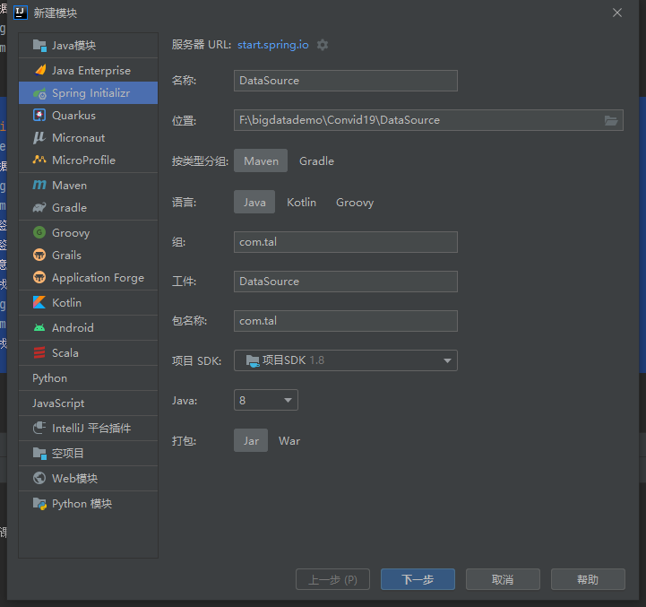

## 疫情数据爬取

### 环境准备

在项目工程下新建Spring boot子模块，后面可以用到定时器




pom文件配置

```xml
<?xml version="1.0" encoding="UTF-8"?>
<project xmlns="http://maven.apache.org/POM/4.0.0" xmlns:xsi="http://www.w3.org/2001/XMLSchema-instance"
         xsi:schemaLocation="http://maven.apache.org/POM/4.0.0 https://maven.apache.org/xsd/maven-4.0.0.xsd">
    <modelVersion>4.0.0</modelVersion>
    <parent>
        <groupId>org.springframework.boot</groupId>
        <artifactId>spring-boot-starter-parent</artifactId>
        <version>2.6.4</version>
        <relativePath/> <!-- lookup parent from repository -->
    </parent>
    <groupId>com.tal</groupId>
    <artifactId>DataSource</artifactId>
    <version>0.0.1-SNAPSHOT</version>
    <name>DataSource</name>
    <description>Demo project for Spring Boot</description>
    <properties>
        <java.version>1.8</java.version>
    </properties>
    <dependencies>
        <dependency>
            <groupId>org.springframework.boot</groupId>
            <artifactId>spring-boot-starter-web</artifactId>
        </dependency>
        <dependency>
            <groupId>org.springframework.kafka</groupId>
            <artifactId>spring-kafka</artifactId>
        </dependency>

        <dependency>
            <groupId>org.springframework.boot</groupId>
            <artifactId>spring-boot-devtools</artifactId>
            <scope>runtime</scope>
            <optional>true</optional>
        </dependency>
        <dependency>
            <groupId>org.projectlombok</groupId>
            <artifactId>lombok</artifactId>
            <optional>true</optional>
        </dependency>
        <dependency>
            <groupId>org.springframework.boot</groupId>
            <artifactId>spring-boot-starter-test</artifactId>
            <scope>test</scope>
        </dependency>
        <dependency>
            <groupId>org.springframework.kafka</groupId>
            <artifactId>spring-kafka-test</artifactId>
            <scope>test</scope>
        </dependency>
        <dependency>
            <groupId>com.alibaba</groupId>
            <artifactId>fastjson</artifactId>
            <version>1.2.22</version>
        </dependency>
        <dependency>
            <groupId>org.apache.httpcomponents</groupId>
            <artifactId>httpclient</artifactId>
            <version>4.5.3</version>
        </dependency>
        <dependency>
            <groupId>org.jsoup</groupId>
            <artifactId>jsoup</artifactId>
            <version>1.10.3</version>
        </dependency>
        <dependency>
            <groupId>junit</groupId>
            <artifactId>junit</artifactId>
            <version>4.12</version>
        </dependency>
        <dependency>
            <groupId>org.apache.commons</groupId>
            <artifactId>commons-lang3</artifactId>
            <version>3.7</version>
        </dependency>
        <dependency>
            <groupId>commons-io</groupId>
            <artifactId>commons-io</artifactId>
            <version>2.6</version>
        </dependency>
        <dependency>
            <groupId>org.slf4j</groupId>
            <artifactId>slf4j-log4j12</artifactId>
            <version>1.7.25</version>
        </dependency>
    </dependencies>

    <build>
        <plugins>
            <plugin>
                <groupId>org.springframework.boot</groupId>
                <artifactId>spring-boot-maven-plugin</artifactId>
                <version>2.6.4</version>
                <configuration>
                    <excludes>
                        <exclude>
                            <groupId>org.projectlombok</groupId>
                            <artifactId>lombok</artifactId>
                        </exclude>
                    </excludes>
                </configuration>
            </plugin>
        </plugins>
    </build>
</project>

```


成功启动，工程建立成功

properties配置

```properties
server.port=9999
#kafka
#服务器地址
kafka.bootstrap.servers=node01:9092,node02:9092,node03:9092
#重试发送消息次数
kafka.retries_config=0
#批量发送的基本单位，默认16384Byte,即16KB
kafka.batch_size_config=4096
#批量发送延迟的上限
kafka.linger_ms_config=100
#buffer内存大小
kafka.buffer_memory_config=40960
#主题
kafka.topic=covid19
```

复制之前的Utils工具类(HttpUtils) 新建TimeUtils工具类

```java
package com.tal.utils;
/* 
    @TODO: 时间工具类
    @Author tal
*/

import org.apache.commons.lang3.time.FastDateFormat;

public abstract class TimeUtils {
    public static String format(Long timestamp, String pattern){
        return FastDateFormat.getInstance(pattern).format(timestamp);
    }

    public static void main(String[] args) {
        String format = TimeUtils.format(System.currentTimeMillis(), "yyyy-MM-dd hh:mm:ss");
        System.out.println(format);
    }
}
```

新建crawler包爬取数据，generator生成数据


### 数据爬取

新建Covid19DataCrawler爬取疫情数据

```java
package com.tal.crawler;
/* 
    @TODO: 实现疫情数据爬取
    @Author tal
*/

import com.tal.utils.HttpUtils;
import org.jsoup.Jsoup;
import org.jsoup.nodes.Document;
import org.junit.Test;

import java.util.regex.Matcher;
import java.util.regex.Pattern;

public class Covid19DataCrawler {
    // 后续将该方法改为定时任务,定时爬取数据
    @Test
    public void testCrawling(){
        // 1、爬取指定页面
        String html = HttpUtils.getHtml("https://ncov.dxy.cn/ncovh5/view/pneumonia");
        // System.out.println(html);

        // 2、解析页面中的指定内容
        Document doc = Jsoup.parse(html);
        String text = doc.select("script[id = getAreaStat]").toString();
        //System.out.println(text);

        // 3、使用正则表达式获取疫情json格式的数据
        String pattern = "\\[(.*)\\]";              //  定义正则规则
        Pattern reg = Pattern.compile(pattern);     //  编译成正则对象
        Matcher matcher = reg.matcher(text);        //  去text中进行匹配
        String jsonStr = "";
        if (matcher.find()){
            jsonStr = matcher.group(0);
            System.out.println(jsonStr);
        }else {
            System.out.println("No Match");
        }

    }
}

```


得到的json数据使用json格式化工具（例：https://www.bejson.com）调整 方便解析，调整后如下所示


根据数据结构新建一个JavaBean

```java
package com.tal.bean;
/* 
    @TODO: 用于封装各省市疫情数据的JavaBean
    @Author tal
*/

import lombok.AllArgsConstructor;
import lombok.Data;
import lombok.NoArgsConstructor;

@Data
@NoArgsConstructor
@AllArgsConstructor
public class CovidBean {
    private String provinceName;                //  省份名称
    private String provinceShortName;           //  省份短名
    private String cityName;
    private String currentConfirmedCount;       //  当前确诊人数
    private String confirmedCount;              //  累计确诊人数
    private String suspectedCount;              //  疑似病例人数
    private String curedCount;                  //  治愈人数
    private String deadCount;                   //  死亡人数
    private String locationId;                  //  位置ID
    private String pid;
    private String statisticsData;              //  每天的统计数据
    private String highDangerCount;
    private String midDangerCount;
    private String detectOrgCount;
    private String vaccinationOrgCount;
    private String cities;                      //  下属城市
    private String datetime;
}

```

### 数据解析