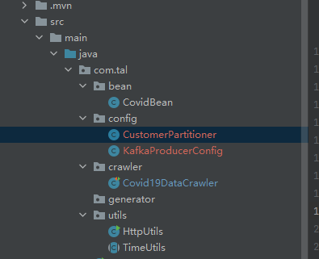

## 疫情数据爬取

### 环境准备

在项目工程下新建Spring boot子模块，后面可以用到定时器


pom文件配置

```xml
<?xml version="1.0" encoding="UTF-8"?>
<project xmlns="http://maven.apache.org/POM/4.0.0" xmlns:xsi="http://www.w3.org/2001/XMLSchema-instance"
         xsi:schemaLocation="http://maven.apache.org/POM/4.0.0 https://maven.apache.org/xsd/maven-4.0.0.xsd">
    <modelVersion>4.0.0</modelVersion>
    <parent>
        <groupId>org.springframework.boot</groupId>
        <artifactId>spring-boot-starter-parent</artifactId>
        <version>2.6.4</version>
        <relativePath/> <!-- lookup parent from repository -->
    </parent>
    <groupId>com.tal</groupId>
    <artifactId>DataSource</artifactId>
    <version>0.0.1-SNAPSHOT</version>
    <name>DataSource</name>
    <description>Demo project for Spring Boot</description>
    <properties>
        <java.version>1.8</java.version>
    </properties>
    <dependencies>
        <dependency>
            <groupId>org.springframework.boot</groupId>
            <artifactId>spring-boot-starter-web</artifactId>
        </dependency>
        <dependency>
            <groupId>org.springframework.kafka</groupId>
            <artifactId>spring-kafka</artifactId>
        </dependency>

        <dependency>
            <groupId>org.springframework.boot</groupId>
            <artifactId>spring-boot-devtools</artifactId>
            <scope>runtime</scope>
            <optional>true</optional>
        </dependency>
        <dependency>
            <groupId>org.projectlombok</groupId>
            <artifactId>lombok</artifactId>
            <optional>true</optional>
        </dependency>
        <dependency>
            <groupId>org.springframework.boot</groupId>
            <artifactId>spring-boot-starter-test</artifactId>
            <scope>test</scope>
        </dependency>
        <dependency>
            <groupId>org.springframework.kafka</groupId>
            <artifactId>spring-kafka-test</artifactId>
            <scope>test</scope>
        </dependency>
        <dependency>
            <groupId>com.alibaba</groupId>
            <artifactId>fastjson</artifactId>
            <version>1.2.22</version>
        </dependency>
        <dependency>
            <groupId>org.apache.httpcomponents</groupId>
            <artifactId>httpclient</artifactId>
            <version>4.5.3</version>
        </dependency>
        <dependency>
            <groupId>org.jsoup</groupId>
            <artifactId>jsoup</artifactId>
            <version>1.10.3</version>
        </dependency>
        <dependency>
            <groupId>junit</groupId>
            <artifactId>junit</artifactId>
            <version>4.12</version>
        </dependency>
        <dependency>
            <groupId>org.apache.commons</groupId>
            <artifactId>commons-lang3</artifactId>
            <version>3.7</version>
        </dependency>
        <dependency>
            <groupId>commons-io</groupId>
            <artifactId>commons-io</artifactId>
            <version>2.6</version>
        </dependency>
        <dependency>
            <groupId>org.slf4j</groupId>
            <artifactId>slf4j-log4j12</artifactId>
            <version>1.7.25</version>
        </dependency>
    </dependencies>

    <build>
        <plugins>
            <plugin>
                <groupId>org.springframework.boot</groupId>
                <artifactId>spring-boot-maven-plugin</artifactId>
                <version>2.6.4</version>
                <configuration>
                    <excludes>
                        <exclude>
                            <groupId>org.projectlombok</groupId>
                            <artifactId>lombok</artifactId>
                        </exclude>
                    </excludes>
                </configuration>
            </plugin>
        </plugins>
    </build>
</project>

```


成功启动，工程建立成功

properties配置

```properties
server.port=9999
#kafka
#服务器地址
kafka.bootstrap.servers=master:9092,slave1:9092,slave2:9092
#重试发送消息次数
kafka.retries_config=0
#批量发送的基本单位，默认16384Byte,即16KB
kafka.batch_size_config=4096
#批量发送延迟的上限
kafka.linger_ms_config=100
#buffer内存大小
kafka.buffer_memory_config=40960
#主题
kafka.topic=covid19
```

复制之前的Utils工具类(HttpUtils) 新建TimeUtils工具类

```java
package com.tal.utils;
/* 
    @TODO: 时间工具类
    @Author tal
*/

import org.apache.commons.lang3.time.FastDateFormat;

public abstract class TimeUtils {
    public static String format(Long timestamp, String pattern){
        return FastDateFormat.getInstance(pattern).format(timestamp);
    }

    public static void main(String[] args) {
        String format = TimeUtils.format(System.currentTimeMillis(), "yyyy-MM-dd hh:mm:ss");
        System.out.println(format);
    }
}
```

新建crawler包爬取数据，generator生成数据


### 数据爬取

新建Covid19DataCrawler爬取疫情数据

```java
package com.tal.crawler;
/* 
    @TODO: 实现疫情数据爬取
    @Author tal
*/

import com.tal.utils.HttpUtils;
import org.jsoup.Jsoup;
import org.jsoup.nodes.Document;
import org.junit.Test;

import java.util.regex.Matcher;
import java.util.regex.Pattern;

public class Covid19DataCrawler {
    // 后续将该方法改为定时任务,定时爬取数据
    @Test
    public void testCrawling(){
        // 1、爬取指定页面
        String html = HttpUtils.getHtml("https://ncov.dxy.cn/ncovh5/view/pneumonia");
        // System.out.println(html);

        // 2、解析页面中的指定内容
        Document doc = Jsoup.parse(html);
        String text = doc.select("script[id = getAreaStat]").toString();
        //System.out.println(text);

        // 3、使用正则表达式获取疫情json格式的数据
        String pattern = "\\[(.*)\\]";              //  定义正则规则
        Pattern reg = Pattern.compile(pattern);     //  编译成正则对象
        Matcher matcher = reg.matcher(text);        //  去text中进行匹配
        String jsonStr = "";
        if (matcher.find()){
            jsonStr = matcher.group(0);
            System.out.println(jsonStr);
        }else {
            System.out.println("No Match");
        }

    }
}

```


得到的json数据使用json格式化工具（例：https://www.bejson.com）调整 方便解析，调整后如下所示


根据数据结构新建一个JavaBean

```java
package com.tal.bean;
/* 
    @TODO: 用于封装各省市疫情数据的JavaBean
    @Author tal
*/

import lombok.AllArgsConstructor;
import lombok.Data;
import lombok.NoArgsConstructor;

@Data
@NoArgsConstructor
@AllArgsConstructor
public class CovidBean {
    private String provinceName;                //  省份名称
    private String provinceShortName;           //  省份短名
    private String cityName;
    private Integer currentConfirmedCount;       //  当前确诊人数
    private Integer confirmedCount;              //  累计确诊人数
    private Integer suspectedCount;              //  疑似病例人数
    private Integer curedCount;                  //  治愈人数
    private Integer deadCount;                   //  死亡人数
    private Integer locationId;                  //  位置ID
    private Integer pid;
    private String statisticsData;              //  每天的统计数据
    private Integer highDangerCount;
    private Integer midDangerCount;
    private Integer detectOrgCount;
    private Integer vaccinationOrgCount;
    private String cities;                      //  下属城市
    private String datetime;
}

```

### 数据解析

```java
// 对json数据进行进一步的解析
        // 4、将第一层的json（省份数据）解析为JavaBean
        List<CovidBean> pCovidBeans = JSON.parseArray(jsonStr, CovidBean.class);
        for(CovidBean pBean : pCovidBeans){ //pBean 为省份
            //System.out.println(pBean);
            // 先设置时间字段
            pBean.setDatetime(datetime);
            // 获取cities
            String citiesStr = pBean.getCities();
            // 5、将第二层json（城市数据）解析为JavaBean
            List<CovidBean> covidBeans = JSON.parseArray(citiesStr, CovidBean.class);
            for(CovidBean bean : covidBeans){   //bean 为城市
                //System.out.println(bean);
                bean.setDatetime(datetime);
                bean.setPid(pBean.getLocationId());
                bean.setProvinceShortName(pBean.getProvinceShortName());
                //System.out.println(bean);
                // 后续需要将城市疫情数据发送给kafka
            }
            // 6、获取第一层json（省份数据）中的每一天的统计数据
            String statisticsDataUrl = pBean.getStatisticsData();
            String statisticsDataStr = HttpUtils.getHtml(statisticsDataUrl);
            // 获取statisticsDataStr中data对应的数据
            JSONObject jsonObject = JSON.parseObject(statisticsDataStr);
            String dataStr = jsonObject.getString("data");
            //System.out.println(dataStr);
            // 将爬取解析出来的数据设置回pBean中的statisticsData,替换原先的url
            pBean.setStatisticsData(dataStr);
            pBean.setCities(null);
            //System.out.println(pBean);
            // 后续需要将城市疫情数据发送给kafka
        }

    }
```

### Kafka Template

新建一个kafka配置文件

```java
// KafkaProducerConfig.java
package com.tal.config;
/* 
    @TODO:  KafkaTemplate 配置类
    @Author tal
*/

import org.apache.kafka.clients.producer.ProducerConfig;
import org.apache.kafka.common.serialization.IntegerSerializer;
import org.apache.kafka.common.serialization.StringSerializer;
import org.springframework.beans.factory.annotation.Value;
import org.springframework.context.annotation.Bean;
import org.springframework.context.annotation.Configuration;
import org.springframework.kafka.core.DefaultKafkaProducerFactory;
import org.springframework.kafka.core.KafkaTemplate;

import java.util.HashMap;
import java.util.Map;

@Configuration  // 表示这是一个配置类，可以读取application.properties的内容
public class KafkaProducerConfig {
    @Value("${kafka.bootstrap.servers}")
    private String bootstrap_servers;                    // 服务器地址
    @Value("${kafka.retries_config}")
    private String retries_config;                       // 重试发送消息次数
    @Value("${kafka.batch_size_config}")
    private String batch_size_config;                    // 批量发送的基本单位，默认16384Byte,即16KB
    @Value("${kafka.linger_ms_config}")
    private String linger_ms_config;                     // 批量发送延迟的上限
    @Value("${kafka.buffer_memory_config}")
    private String buffer_memory_config;                 // buffer内存大小

    @Bean   // 表示该方法返回的对象交给spring管理
    public KafkaTemplate getKafkaTemplate(){
        Map<String, Object> config = new HashMap<>();
        config.put(ProducerConfig.BOOTSTRAP_SERVERS_CONFIG, bootstrap_servers);
        config.put(ProducerConfig.RETRIES_CONFIG, retries_config);
        config.put(ProducerConfig.BATCH_SIZE_CONFIG, batch_size_config);
        config.put(ProducerConfig.LINGER_MS_CONFIG, linger_ms_config);
        config.put(ProducerConfig.BUFFER_MEMORY_CONFIG, buffer_memory_config);
        // 设置发送到kafka中的消息的key/value序列化类型，指定为<LocationId: Integer, Value: String>
        config.put(ProducerConfig.KEY_SERIALIZER_CLASS_CONFIG, IntegerSerializer.class);
        config.put(ProducerConfig.VALUE_SERIALIZER_CLASS_CONFIG, StringSerializer.class);
        // 指定自定义分区器
        config.put(ProducerConfig.PARTITIONER_CLASS_CONFIG,CustomerPartitioner.class);
        DefaultKafkaProducerFactory producerFactory = new DefaultKafkaProducerFactory(config);
        KafkaTemplate kafkaTemplate = new KafkaTemplate(producerFactory);
        return kafkaTemplate;
    }

}

```

中途创建了一个CustomerPartitioner.java

```java
// CustomerPartitioner.java
package com.tal.config;
/* 
    @TODO: 自定义分区器指定分区规则（默认是按照key的hash）
    @Author tal
*/


import org.apache.kafka.clients.producer.Partitioner;
import org.apache.kafka.common.Cluster;

import java.util.Map;

public class CustomerPartitioner implements Partitioner {
    // 根据参数按照指定的规则进行分区，返回分区编号即可
    @Override
    public int partition(String topic, Object key, byte[] keyBytes, Object value, byte[] valueBytes, Cluster cluster) {
        Integer k = (Integer) key;
        Integer num = cluster.partitionCountForTopic(topic);
        int partition = k % num;
        return partition;
    }

    @Override
    public void close() {

    }

    @Override
    public void configure(Map<String, ?> map) {

    }
}
```



测试

创建测试类

```java
package com.tal.config;
/* 
    @TODO: 测试Kafka配置
    @Author tal
*/

import org.junit.Test;
import org.junit.runner.RunWith;
import org.springframework.beans.factory.annotation.Autowired;
import org.springframework.boot.test.context.SpringBootTest;
import org.springframework.kafka.core.KafkaTemplate;
import org.springframework.test.context.junit4.SpringJUnit4ClassRunner;


@RunWith(SpringJUnit4ClassRunner.class)
@SpringBootTest
public class TestKafka {
    @Autowired
    private KafkaTemplate kafkaTemplate;

    @Test
    public void testKafkaTemplate() throws Exception {
        kafkaTemplate.send("test",1,"abc");
        Thread.sleep(10000000);
    }
}
```

```shell
# 启动zookeeper、kafka后创建新的topic
kafka-topics.sh --zookeeper master:2181 --create --replication-factor 2 --partitions 3 --topic test

# 消费者消费
kafka-console-consumer.sh --bootstrap-server master:9092 --topic test
```


通信成功

### 数据爬取之后发给kafka

```java
// 分别添加
String beanStr = JSON.toJSONString(bean);
kafkaTemplate.send("covid19",bean.getPid(),beanStr);


String pBeanStr = JSON.toJSONString(pBean);
kafkaTemplate.send("covid19",pBean.getLocationId(),pBeanStr);
```

新建covid19主题已经使用消费者消费

```shell
kafka-topics.sh --zookeeper master:2181 --create --replication-factor 2 --partitions 3 --topic covid19

kafka-console-consumer.sh --bootstrap-server master:9092 --topic covid19
```

运行报错

```shell
Caused by: org.apache.kafka.common.errors.RecordTooLargeException: The message is 219585 bytes when serialized which is larger than the total memory buffer you have configured with the buffer.memory configuration.
```

修改kafka配置中的buffer_memory的值即可


### 定时爬取

定时测试

```java
// SchedulerTest.java

package com.tal.crawler;
/* 
    @TODO: 演示定时任务
    @Author tal
*/

import org.springframework.scheduling.annotation.Scheduled;
import org.springframework.stereotype.Component;

import java.util.Timer;
import java.util.TimerTask;

@Component  // 表示将给类交给Spring管理，作为Spring容器中的对象
public class SchedulerTest {
    public static void main(String[] args) {
        // 演示JDK中自带的定时任务
        Timer timer = new Timer();
        timer.schedule(new TimerTask() {
            @Override
            public void run() {
                System.out.println("每隔一秒执行一次");
            }
        },1000, 1000);
    }

    // 演示SpringBoot中提供的定时任务工具
    @Scheduled(initialDelay = 1000, fixedDelay = 1000)
    public void scheduled(){
        System.out.println("每隔一秒执行一次");
    }
}

```

入口类需要添加


将相应代码写入Covid19DataCrawler中

## 数据生成

新建类Covid19DataGenerator

```java
package com.tal.generator;
/* 
    @TODO: 使用程序模拟生成疫情数据
    @Author tal
*/

import com.alibaba.fastjson.JSON;
import com.tal.bean.MateriaBean;
import org.springframework.beans.factory.annotation.Autowired;
import org.springframework.kafka.core.KafkaTemplate;
import org.springframework.scheduling.annotation.Scheduled;
import org.springframework.stereotype.Component;

import java.util.Random;

@Component
public class Covid19DataGenerator {

    @Autowired
    private KafkaTemplate kafkaTemplate;

    //@Scheduled(initialDelay = 1000, fixedDelay = 1000 * 10)
    public void generator() {
        Random ran = new Random();
        for (int i = 0; i < 10; i++) {
            MateriaBean materiaBean = new MateriaBean(wzmc[ran.nextInt(wzmc.length)], wzly[ran.nextInt(wzly.length)], ran.nextInt(1000));
            System.out.println(materiaBean);
            //将生成的疫情物资数据转换为jsonStr再发送到Kafka集群
            String jsonStr = JSON.toJSONString(materiaBean);
            kafkaTemplate.send("covid19_wz", ran.nextInt(3),jsonStr);
        }
    }

    //物资名称
    private String[] wzmc = new String[]{"N95口罩/个", "医用外科口罩/个", "84消毒液/瓶", "电子体温计/个", "一次性手套/副", "护目镜/副", "医用防护服/套"};

    //物质来源
    private String[] wzly = new String[]{"采购", "下拨", "捐赠", "消耗", "需求"};

}

```

新建JavaBean（MateriaBean）

```java
package com.tal.bean;
/* 
    @TODO: 用来封装防疫物资的JavaBean
    @Author tal
*/

import lombok.AllArgsConstructor;
import lombok.Data;
import lombok.NoArgsConstructor;

@Data
@AllArgsConstructor
@NoArgsConstructor
public class MateriaBean {
    private String name;//物资名称
    private String from;//物质来源
    private Integer count;//物资数量
}


```

新建kafka主题

```shell
kafka-console-consumer.sh --bootstrap-server master:9092 --topic covid19_wz
```

